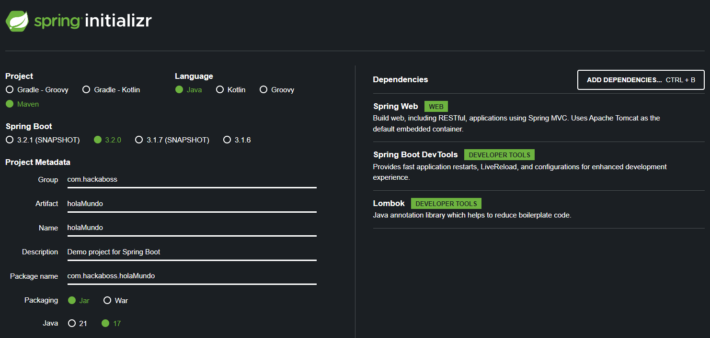
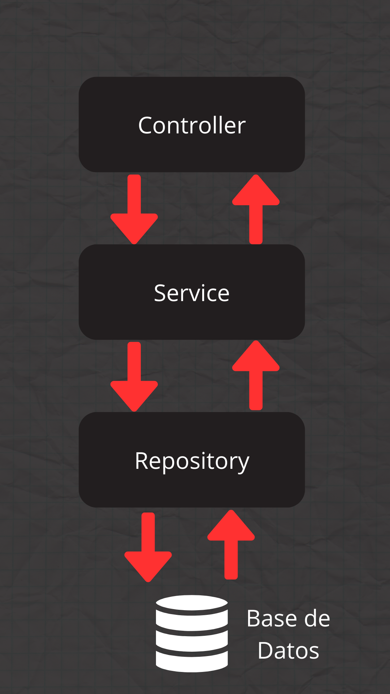
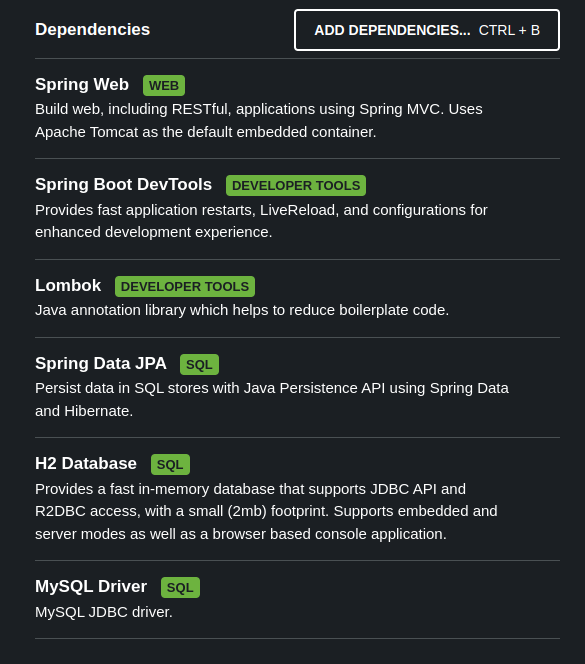

# Spring Boot
# Índice
- [Initializr](#initializr)
	- [Dependencias](#dependencias)
- [Anotaciones API](#anotaciones-api)
	- [@GetMapping](#getmapping)
	- [Parámetros en APIs](#parámetros-en-apis)
		- [@PathVariable](#pathvariable)
		- [@RequestParam](#requestparam)
	- [@RequestMapping](#requestMapping)
	- [@PostMapping](#postmapping)
	- [@PutMapping](#putmapping)
	- [@DeleteMapping](#deletemapping)
	- [@RequestBody](#requestbody)
	- [@ResponseBody](#responsebody)
- [Lombok](#lombok)
- [Arquitectura Multicapa](#arquitectura-multicapa)
- [Inyección de dependencias](#inyección-de-dependencias)
- [Envioroment](#envioroment)
	- [Configuración de variables de entorno](#configuración-de-variables-de-entorno)
	- [Crear nuestras propias variables de entorno](#crear-nuestras-propias-variables-de-entorno)
- [JPA e Hibernate](#jpa-e-hibernate)
	- [Anotaciones](#anotaciones)
	- [Integración de JPA en Spring Boot](#integración-de-jpa-en-spring-boot)
	- [CRUD](#crud)
- [Spring Data JPA](#spring-data-jpa)
	- [Métodos Derivados (Query Methods)](#métodos-derivados-query-methods)
	- [JPQL con @Query](#jpql-con-query)
	- [SQL Nativo con @Query](#sql-nativo-con-query)
- [ResponseEntity](#responseentity)
- [Starter Validation](#starter-validation)
- [Excepciones](#excepciones)
	- [GlobalExceptionHandler](#globalexceptionhandler)
	- [Excepciones personalizadas](#excepciones-personalizadas)
	- [ErrorResponse](#errorresponse)
- [Spring Security](#spring-security)
	- [Configuración de Seguridad](#configuración-de-seguridad)
	- [Implementación de JWT](#implementación-de-jwt)
- [OpenAPI](#openapi)
- [Testing](#testing)
- [Despliegue con Docker](#despliegue-con-docker)
# Initializr
Para la creación de un proyecto, utilizaremos `Initializr`, una herramienta en línea que simplifica la creación y configuración inicial de proyectos basados en Spring Boot. Esta herramienta permite a los desarrolladores iniciar rápidamente nuevos proyectos al ofrecer una interfaz web intuitiva y fácil de usar.

Para acceder a `Initializr`, debemos ingresar a: [start.spring.io](https://start.spring.io/)



El uso de Initializr es muy sencillo. Una vez accedemos a la página, solo necesitamos seleccionar la versión de Spring Boot que deseamos utilizar, el gestor de dependencias (como Maven en este caso), la metadata de nuestro proyecto, y las dependencias iniciales necesarias, junto con la versión del JDK.

Una vez configurado todo, hacemos clic en 'Generate' y obtendremos un archivo comprimido .zip con la estructura base de nuestro proyecto. Solo debemos descomprimirlo y abrirlo en el IDE de nuestra preferencia para comenzar a trabajar.
## Dependencias
Cuando creamos un proyecto a través de **Spring Initializr**, podemos incluir diferentes dependencias según el propósito del proyecto. A continuación, veremos algunos ejemplos:
### Para una API
Podríamos utilizar las siguientes dependencias:

- **Spring Web**: Permite crear aplicaciones web y RESTful APIs.
- **Spring Boot DevTools**: Proporciona herramientas para desarrollo, como reinicios automáticos.
- **Lombok**: Reduce el código repetitivo, como getters, setters y constructores.

### Persistencia de datos
En la mayoría de los proyectos, es común querer persistir datos en una base de datos. Aunque este tema se tratará más adelante en la sección de **JPA**, las dependencias habituales son:

- **Spring Data JPA**: Simplifica el acceso a bases de datos mediante repositorios.
- **MySQL Driver**: Permite la conexión con bases de datos MySQL.
- **Validation**: Proporciona una forma sencilla de validar objetos, garantizando la integridad y coherencia de los datos.
### Base de datos en memoria
Adicionalmente, existe una dependencia llamada **H2 Database**. Aunque no es obligatoria, puede ser útil para pruebas o desarrollo rápido, ya que proporciona una base de datos en memoria.
### Seguridad
Si necesitamos gestionar el registro de usuarios en nuestra API, es recomendable implementar una capa de seguridad utilizando **Spring Security**, junto con **JWT** para la autenticación y autorización. Este tema se abordará con más detalle en otro apartado.
# Anotaciones API
**Spring Boot** utiliza anotaciones para gestionar y facilitar su funcionamiento. A continuación, exploraremos en detalle algunas de las anotaciones más importantes y su propósito dentro del framework.
## @GetMapping
La anotación `@GetMapping` en Spring se utiliza para mapear solicitudes HTTP de tipo **GET** a métodos específicos dentro de los controladores. Es una forma simplificada y más legible de definir rutas para manejar este tipo de peticiones.

En el contexto de aplicaciones web desarrolladas con Spring, las solicitudes HTTP (GET, POST, PUT, DELETE, etc.) son gestionadas por métodos definidos en los controladores. Estos métodos procesan las solicitudes entrantes y generan una respuesta adecuada para el cliente, ya sea en formato JSON, XML o contenido HTML.
```java
import org.springframework.web.bind.annotation.GetMapping;
import org.springframework.web.bind.annotation.RestController;
@RestController
public class ProductoController {
    @GetMapping("/productos") // Esta anotación indica que este método manejará las solicitudes GET a la URL /productos
    public String obtenerProductos() {
        // Supongamos que aquí obtienes los productos de una base de datos o servicio
        // En este ejemplo, simplemente se devuelve una cadena con información sobre los productos
        return "Lista de productos: Product A, Product B, Product C";
    }
}
```
## Parámetros en APIs
Las anotaciones `@PathVariable` y `@RequestParam` en **Spring** permiten extraer datos proporcionados por el cliente en solicitudes HTTP. Sin embargo, su uso varía según el contexto:

- **`@PathVariable`** se utiliza para capturar valores directamente de la URL, generalmente definidos como parte de la ruta.
- **`@RequestParam`** se emplea para extraer parámetros enviados como parte de la consulta (query parameters) en la URL.

|**Aspecto**|**`@PathVariable`**|**`@RequestParam`**|
|---|---|---|
|**Fuente de datos**|Parte de la ruta en la URL|Parámetros de consulta en la URL|
|**Ejemplo de URL**|`/usuarios/{id}`|`/usuarios?nombre=Juan`|
|**Definición en código**|`@GetMapping("/usuarios/{id}")`  <br>`public Usuario getUsuario(@PathVariable Long id)`|`@GetMapping("/usuarios")`  <br>`public List<Usuario> getUsuarios(@RequestParam String nombre)`|
|**Usos comunes**|Identificadores únicos o elementos obligatorios en la ruta|Filtros, búsquedas o datos opcionales enviados por el cliente|
### @PathVariable
La anotación `@PathVariable` se utiliza para extraer datos directamente de la URL de una solicitud HTTP y vincularlos a los parámetros de un método en el controlador. Es especialmente útil para capturar valores dinámicos definidos como variables en la estructura de la URL.
#### Ejemplo
Supongamos que tienes una URL como `/usuarios/{id}`, donde `{id}` es el identificador de un usuario. Puedes usar `@PathVariable` para capturar ese `id` y utilizarlo en tu método del controlador:
```java
@GetMapping("/usuarios/{id}")
public String obtenerUsuarioPorId(@PathVariable Long id) {
    // Utiliza el id recibido para obtener el usuario con ese identificador
    return "Detalles del usuario con ID: " + id;
}
```
### @RequestParam
La anotación `@RequestParam` se utiliza para extraer datos de los parámetros de consulta (**query parameters**) en solicitudes HTTP, ya sean de tipo **GET** o **POST**. Estos parámetros se envían como parte de la URL, después del símbolo `?`.
#### Ejemplo
Supongamos que tienes una URL como `/productos?categoria=electronicos`, donde `categoria` es un parámetro de consulta. Puedes usar `@RequestParam` para obtener el valor de ese parámetro:
```java
@GetMapping("/productos")
public String obtenerProductosPorCategoria(@RequestParam String categoria) {
    // Utiliza el parámetro 'categoria' recibido para buscar productos de esa categoría
    return "Lista de productos de la categoría: " + categoria;
}
```
## @RequestMapping
La anotación `@RequestMapping` en **Spring** se utiliza para mapear solicitudes HTTP a métodos específicos dentro de un controlador en una aplicación web.

Esta anotación permite definir la URL o patrón de URL que un método del controlador manejará. Puede aplicarse tanto a nivel de clase como a nivel de método, proporcionando flexibilidad en la configuración de rutas.

Además, con `@RequestMapping` es posible especificar los métodos HTTP (como **GET**, **POST**, **PUT**, **DELETE**, entre otros) que el método del controlador manejará.

Una característica importante de esta anotación es que permite incluir variables dentro de la URL, utilizando `{}` para capturar valores dinámicos, y también facilita el manejo de parámetros de solicitud.
```
@RestController
@RequestMapping("/api")
public class EjemploController {

    @GetMapping("/ejemplo")
    public String ejemplo() {
        return "¡Ejemplo de RequestMapping!";
    }
}
```

En este caso, `@RequestMapping("/api")` a nivel de clase indica que todos los métodos dentro de `EjemploController` manejarán solicitudes que comiencen con `/api`.

También es posible que podamos mapear una clase controladora a varias posibilidades de path o url, un ejemplo podría ser:

```java
@RestController
@RequestMapping(value = {"/usuarios", "/clientes"}, method = {RequestMethod.GET, RequestMethod.POST})
public class UserController {
    // Métodos para manejar solicitudes GET y POST a /usuarios o /clientes
}
```
## @PostMapping
La anotación `@PostMapping` en **Spring** se utiliza para mapear solicitudes HTTP de tipo **POST** a métodos específicos dentro de los controladores.

En el contexto de una aplicación web con Spring, `@PostMapping` es comúnmente empleada cuando se trabaja con formularios HTML o cuando se envían datos al servidor mediante una solicitud POST. Esta anotación facilita la gestión y el procesamiento de los datos enviados, permitiendo que el controlador maneje y responda a la solicitud de manera eficiente.
#### Ejemplo
Supongamos que tienes una aplicación web donde los usuarios pueden registrarse a través de un formulario. Utilizaremos `@PostMapping` para manejar la solicitud de registro de un nuevo usuario.
```java
import org.springframework.beans.factory.annotation.Autowired;
import org.springframework.stereotype.Controller;
import org.springframework.web.bind.annotation.PostMapping;
import org.springframework.web.bind.annotation.RequestParam;
import org.springframework.web.servlet.ModelAndView;

@Controller
public class RegistroUsuarioController {

    private final UsuarioService usuarioService;

    @Autowired
    public RegistroUsuarioController(UsuarioService usuarioService) {
        this.usuarioService = usuarioService;
    }

    @PostMapping("/registro")
    public ModelAndView registrarNuevoUsuario(@RequestParam("nombre") String nombre,
                                             @RequestParam("email") String email,
                                             @RequestParam("contrasena") String contrasena) {
        // Crear un nuevo usuario con los datos proporcionados
        Usuario nuevoUsuario = new Usuario(nombre, email, contrasena);
        
        // Guardar el nuevo usuario en la base de datos a través del servicio de usuarios
        usuarioService.registrarUsuario(nuevoUsuario);

        // Redirigir a una página de éxito o a otra vista
        ModelAndView modelAndView = new ModelAndView("exito-registro");
        modelAndView.addObject("nombreUsuario", nombre);
        return modelAndView;
    }
}
```
## @PutMapping
La anotación `@PutMapping` se utiliza para manejar solicitudes HTTP PUT. Este tipo de solicitudes generalmente se utiliza para actualizar recursos existentes en el servidor.

Cuando trabajemos con JPA, veremos cómo esta anotación puede usarse junto con métodos de un repositorio o servicio para actualizar registros en la base de datos.
## @DeleteMapping
La anotación `@DeleteMapping` se utiliza para manejar solicitudes HTTP DELETE. Este tipo de solicitudes se emplea para eliminar recursos del servidor.

En el apartado de JPA, exploraremos cómo esta anotación se utiliza en métodos para eliminar registros de la base de datos.
## @RequestBody
La anotación `@RequestBody` se utiliza para vincular el cuerpo de una solicitud HTTP con un objeto Java en el controlador. Su propósito es recibir datos enviados desde el cliente, como un JSON o XML, y convertirlos automáticamente en una instancia del objeto Java correspondiente, facilitando la manipulación de la información en el servidor.
#### Ejemplo
Supongamos que se recibe una solicitud POST con datos en formato JSON para crear un nuevo objeto `Producto` en una aplicación web:
```java
import org.springframework.web.bind.annotation.PostMapping;
import org.springframework.web.bind.annotation.RequestBody;
import org.springframework.web.bind.annotation.RestController;

@RestController
public class ProductoController {

    @PostMapping("/productos")
    public String crearProducto(@RequestBody Producto nuevoProducto) {
        // Realizar alguna lógica con el nuevo producto, como guardarlo en una base de datos
        // nuevoProducto contiene los datos enviados desde el cliente en formato JSON

        return "Producto creado: " + nuevoProducto.getNombre();
    }
}
```
## @ResponseBody
Al igual que podemos manejar las solicitudes (requests) y sus cuerpos (bodies), también podemos hacer lo mismo con las respuestas (responses).

La anotación `@ResponseBody` en **Spring** se utiliza en los métodos del controlador para indicar que el valor retornado por el método debe ser directamente utilizado como el cuerpo de la respuesta HTTP.

- Al anotar un método con `@ResponseBody`, se especifica que el objeto devuelto será serializado automáticamente en el formato adecuado (como JSON o XML) y se incluirá en el cuerpo de la respuesta HTTP, sin pasar por la resolución de vistas.
- Esta anotación es especialmente útil cuando se desea devolver datos al cliente en formatos como JSON o XML sin necesidad de generar una vista, lo que facilita la construcción de APIs y servicios RESTful.
#### Ejemplo
Supongamos que se desea devolver un objeto de tipo `Persona` como JSON en la respuesta:
```java
import org.springframework.web.bind.annotation.GetMapping;
import org.springframework.web.bind.annotation.ResponseBody;
import org.springframework.web.bind.annotation.RestController;

@RestController
public class PersonaController {

    @GetMapping("/persona")
    public @ResponseBody Persona obtenerPersona() {
        Persona persona = new Persona("Juan", 30);
        return persona;
    }
}
```
# Lombok
Lombok es una biblioteca para Java diseñada para eliminar gran parte del **código boilerplate**, es decir, ese código repetitivo y básico que suele ser necesario en las clases Java, como getters, setters, constructores, métodos `equals()`, `hashCode()` y otros métodos comunes.

Esta herramienta funciona mediante anotaciones que se aplican directamente a las clases, generando automáticamente el código que normalmente tendrías que escribir manualmente. Algunas de las anotaciones más utilizadas en Lombok incluyen:

- **@Getter** y **@Setter**: generan los métodos getter y setter para todos los campos de la clase.
- **@NoArgsConstructor**: crea un constructor sin parámetros.
- **@AllArgsConstructor**: genera un constructor con parámetros para todos los campos.
- **@ToString**: crea automáticamente un método `toString()`.
- **@EqualsAndHashCode**: genera los métodos `equals()` y `hashCode()`.
- **@Data**: combina las anotaciones **@Getter**, **@Setter**, **@ToString**, **@EqualsAndHashCode** y **@RequiredArgsConstructor** en una sola anotación. Es ideal para clases que representan datos (Data Transfer Objects o entidades simples).

```java
@Getter @Setter
@NoArgsConstructor
@AllArgsConstructor
public class Alumno {
    private int id;
    private String nombre;
	private String apellido;
}
```
> ⚠️ **Nota Importante**  
> Aunque agregar la dependencia de Lombok a nuestro proyecto es el primer paso, esto no es suficiente para que funcione correctamente en nuestro IDE. Es necesario realizar configuraciones adicionales para garantizar que Lombok sea reconocido y funcione como se espera.
### **@Builder**: Construcción de objetos simplificada
La anotación **@Builder** de Lombok permite crear objetos complejos de forma clara y legible. Es especialmente útil cuando las clases tienen muchos campos o necesitas construir objetos con un orden flexible de parámetros.
#### Ventajas de usar `@Builder`:
- **Legibilidad:** Construye objetos de manera declarativa, evitando errores comunes al usar constructores tradicionales.
- **Orden flexible:** Los campos pueden inicializarse en cualquier orden.
- **Facilidad para manejar valores opcionales:** Es ideal para clases con muchos atributos, donde algunos pueden ser opcionales.
```java
@Builder
public class User {
    private String name;
    private String email;
    private int age;
}

public class Main {
    public static void main(String[] args) {
        User user = User.builder()
                .name("John Doe")
                .email("john.doe@example.com")
                .age(30)
                .build();
    }
}
```
#### Consideraciones:
1. **Uso combinado con inmutabilidad:** Si marcas los campos como `final`, puedes garantizar que los objetos sean inmutables.
2. **No para clases simples:** Si tu clase tiene pocos atributos, el uso de `@Builder` puede ser innecesario y menos eficiente.
3. **Rendimiento:** El `Builder` crea un objeto intermedio antes de construir la instancia final, lo cual puede ser irrelevante para la mayoría de los casos, pero debe considerarse en sistemas de alto rendimiento.
#### Configuración en IntelliJ IDEA
Para que Lombok funcione correctamente en IntelliJ IDEA, es necesario realizar las siguientes configuraciones:
1. **Instalar el plugin de Lombok:**
    - Ve a `File > Settings > Plugins`.
    - Busca e instala el plugin llamado **Lombok**. Esto permitirá que el IDE reconozca las anotaciones y habilite el autocompletado.
2. **Habilitar el procesamiento de anotaciones:**
    - Dirígete a `File > Settings > Build, Execution, Deployment > Compiler > Annotation Processors > Default`.
    - Asegúrate de marcar la opción **Enable annotation processing**.
3. **Configuración específica del proyecto (opcional):**
    - Si después de realizar los pasos anteriores Lombok sigue sin funcionar, revisa la configuración del procesador de anotaciones a nivel del proyecto.
    - Ve al mismo apartado (`Build, Execution, Deployment > Compiler > Annotation Processors`), pero selecciona tu proyecto en lugar de "Default".
    - Asegúrate de que esté marcada la opción **Obtain processors from project classpath**.

Con esta configuración debería ser suficiente para que Lombok funcione correctamente. Sin embargo, si necesitas una guía más visual, puedes consultar este [video](https://www.youtube.com/watch?v=btZ06QRKaPE&list=WL&index=1&t=5s)
# Arquitectura Multicapa
La arquitectura multicapa en proyectos de Java Spring Boot organiza las responsabilidades en diferentes capas, lo que facilita la separación de preocupaciones, mejora la modularidad, simplifica el mantenimiento y favorece la escalabilidad del sistema. A continuación, se describen las cinco capas principales y sus responsabilidades:


## 1. Repository (DAO - Data Access Object)
Esta capa se encarga de interactuar directamente con la base de datos o el sistema de almacenamiento de datos. Aquí se definen las operaciones de acceso a datos como consultas, inserciones, actualizaciones y eliminaciones (CRUD).

Cada clase en esta capa suele representarse mediante la anotación `@Repository`, que marca el componente como un manejador de datos y permite a Spring gestionarlo automáticamente.
### @Repository
Es una especialización de `@Component` diseñada para marcar las clases responsables de interactuar con la capa de persistencia o acceso a datos, conocida como la capa Repository o DAO (Data Access Object). Esta anotación indica que la clase es un componente dedicado a gestionar las operaciones relacionadas con la base de datos, como consultas, inserciones, actualizaciones y eliminaciones.

Esto se explicará con más detalle en el apartado de JPA, el cual también permitirá visualizar de manera más clara cómo funciona la arquitectura multicapa.
```java
@Repository
public interface PersonaRepository extends JpaRepository<Persona,Long> {
    // Métodos personalizados opcionales
}
```
### 2. Entity (Model)
Representa las entidades o clases de dominio de la aplicación. Estas clases mapean directamente las tablas de la base de datos y contienen los atributos y relaciones entre entidades.

- Se utiliza comúnmente la anotación `@Entity` para indicar que una clase es una entidad de base de datos.
- Los atributos de las entidades pueden anotarse con `@Column`, `@Id`, `@GeneratedValue`, entre otras, para definir su comportamiento y mapeo en la base de datos.

Estas anotaciones relacionadas con las entidades se explicarán con más detalle en el apartado de JPA, ya que, en ausencia de persistencia, resultan completamente innecesarias.
```java
@Getter @Setter
@AllArgsConstructor
@NoArgsConstructor
@Entity
public class Persona {
    @Id
    @GeneratedValue(strategy=GenerationType.SEQUENCE)
    private Long id;
    private String nombre;
    private String apellido;
    private int edad;
}
```
### 3. DTO (Data Transfer Object)
Los DTO son objetos diseñados para transferir datos entre las diferentes capas de la aplicación. Se utilizan para controlar y limitar qué datos se exponen a través de la API y cómo se presentan a los clientes.

- Permiten desacoplar las entidades del modelo de dominio de las vistas o las respuestas API, asegurando que solo se transmitan los datos necesarios.
- Son especialmente útiles para gestionar estructuras complejas o proteger información sensible.
#### Ejemplo
Imaginemos que tenemos dos clases: `Equipo` y `Jugador`. Un equipo contiene una lista de jugadores. Supongamos que en un endpoint queremos obtener todos los jugadores de un equipo, pero no necesitamos mostrar toda la información. Solo nos interesa mostrar el nombre del equipo y el nombre de cada jugador. En un caso como este, resulta útil utilizar un DTO (Data Transfer Object) para estructurar y devolver únicamente los datos que queremos exponer en la API.
```java
@Getter @Setter  
@AllArgsConstructor  
public class JugadoresEquipoDTO {  
    private String nombre;  
    private List<String> jugadores;  
}
```
Una vez creado el DTO, podemos integrarlo en el service.
```java
public JugadoresEquipoDTO findJugadoresById(@PathVariable Long id) {  
    return findAll().stream()  
            .filter(equipo -> equipo.getId().equals(id))  
            .findFirst()  
            .map(equipo -> new JugadoresEquipoDTO(  
                    equipo.getNombre(),  
                    equipo.getJugadores().stream().map(Jugador::getNombre).toList()  
            ))  
            .orElse(null);  
}
```
Gracias al DTO, podemos controlar la información que expone la API, asegurándonos de mostrar solo los datos necesarios y evitando información innecesaria.
```json
{
    "nombre": "Real Madrid",
    "jugadores": [
        "Karim Benzema",
        "Luka Modric"
    ]
}
```
## 4. Service
Contiene la lógica de negocio de la aplicación. Esta capa implementa operaciones complejas que involucran procesamiento de datos, validaciones y coordinación entre diferentes repositorios.

- Las clases en esta capa suelen anotarse con `@Service`, lo que permite que Spring las detecte como componentes de servicio.
- Promueve la independencia de la lógica de negocio respecto de las capas de datos y de presentación.
### @Service
Es una especialización de `@Component` que se utiliza para identificar clases que contienen la lógica de negocio o los servicios de la aplicación. Estas clases pertenecen exclusivamente a la capa de servicio, donde se centralizan las operaciones complejas y la coordinación entre diferentes componentes.

Para implementar correctamente la capa de servicio, es recomendable seguir un diseño basado en interfaces. Esto implica:

- Crear una **interfaz** para cada clase de servicio, definiendo en ella los métodos abstractos (sin implementar) que representarán las operaciones del servicio.
- Hacer que la clase de servicio implemente su correspondiente interfaz, asegurando así una mayor flexibilidad, facilidad de prueba y separación de responsabilidades.

De esta forma, por cada clase de servicio, habrá una interfaz asociada que actúa como contrato, promoviendo un diseño más modular y orientado a buenas prácticas.
#### Ejemplo
Imaginemos una clase `AlumnoService` que será responsable de implementar las diversas acciones que un alumno puede realizar dentro de un sistema. Para seguir buenas prácticas de diseño, esta clase debe implementar una interfaz que defina el contrato de las acciones disponibles.

La interfaz debe tener el mismo nombre que la clase de servicio, pero con un prefijo "I" para identificarla como interfaz. En este caso, la interfaz se llamaría `IAlumnoService`. Esto asegura claridad en la estructura del proyecto y facilita la implementación de dependencias desacopladas, lo que mejora la mantenibilidad y la escalabilidad del sistema.
#### Interface IAlumnoService
```java
public interface IAlumnoService {
	public void crearAlumno (Alumno alu);
	public List<Alumno> obtenerAlumnos();
}
```
#### Implementación AlumnoService
```java
@Service
public class AlumnoService implements IAlumnoService {

    @Override
    public void crearAlumno (Alumno alu) {
	    //lógica para crear el alumno
    }

    @Override
    public List<Alumno> obtenerAlumnos() {
	    //lógica para buscar alumnos y devolver la lista
    }
}
```
## 5. Controller
Esta capa gestiona la interacción con el cliente. Es responsable de recibir las solicitudes HTTP, invocar los métodos de servicio correspondientes y devolver las respuestas adecuadas.

- Las clases controladoras suelen definirse con las anotaciones `@RestController` para indicar que son controladores de servicios REST y `@RequestMapping` para mapear las solicitudes HTTP a métodos específicos.
- Pueden incluir validaciones de entrada y formateo de las respuestas para asegurar una buena experiencia del cliente.
### @Controller y @RestController
La anotación `@Controller` se utiliza para marcar clases como controladores en una arquitectura MVC (Model-View-Controller). Los controladores tienen la responsabilidad de manejar solicitudes HTTP, invocar la lógica de negocio y preparar los datos para enviarlos a las vistas, que finalmente se presentan al cliente.

Por otro lado, `@RestController` es una anotación que extiende la funcionalidad de `@Controller`. Combina las anotaciones `@Controller` y `@ResponseBody`, lo que significa que todos los métodos de la clase automáticamente devuelven las respuestas directamente en formato JSON o XML, en lugar de renderizar vistas.

**Diferencias clave:**

- **`@Controller`**: Se utiliza para aplicaciones donde se generan vistas (por ejemplo, con Thymeleaf o JSP). Las respuestas pueden ser plantillas HTML o redirecciones.
- **`@RestController`**: Se emplea para crear endpoints RESTful que devuelven datos en formato JSON (el formato más utilizado actualmente).

En proyectos modernos, especialmente aquellos que exponen APIs, es común el uso de `@RestController` debido a su enfoque en servicios REST y la facilidad para manejar datos JSON.
```java
import org.springframework.web.bind.annotation.RestController;
@RestController
public class ProductoController {
    // methods
}
```
# Inyección de dependencias
La inyección de dependencias es un patrón de diseño que permite que las clases reciban sus dependencias en lugar de crearlas manualmente. Spring Boot facilita este proceso mediante su contenedor de inversión de control (IoC), que gestiona la creación e inyección de beans de forma automática.

| Enfoque                     | Uso recomendado                                      |
| --------------------------- | ---------------------------------------------------- |
| `@Autowired` en atributos   | ❌ NO recomendado                                     |
| `@Autowired` en constructor | ✅ Mejor que el anterior                              |
| `@RequiredArgsConstructor`  | ⭐ Mejor opción si todas las dependencias son `final` |

Se recomienda usar `@RequiredArgsConstructor` cuando todas las dependencias sean obligatorias y `final`. Si alguna dependencia es opcional, se puede usar `@Autowired` en el constructor manualmente. Evita siempre `@Autowired` en atributos para mejorar la inmutabilidad y testabilidad.
### Uso de `@Autowired`
La anotación `@Autowired` automatiza la inyección de dependencias en clases, métodos o constructores, permitiendo que Spring asigne los objetos requeridos sin necesidad de instanciarlos manualmente.
#### Ejemplo con `@Autowired` en atributos (NO recomendado)
```java
@RestController
@RequestMapping("/equipos")
public class EquipoController {
    
    @Autowired
    private IEquipoService equipoService;

    @GetMapping
    public List<Equipo> findAll() {
        return equipoService.findAll();
    }
}
```

**Problemas de este enfoque:**
- Dificulta las pruebas unitarias porque no se pueden inyectar dependencias manualmente.
- No permite la inmutabilidad de los atributos.
### Uso de inyección por constructor (RECOMENDADO)
Una mejor práctica es inyectar dependencias a través del constructor. Esto favorece la inmutabilidad y facilita las pruebas unitarias.
#### Ejemplo con inyección por constructor
```java
@RestController
@RequestMapping("/equipos")
public class EquipoController {
    
    private final IEquipoService equipoService;

    @Autowired
    public EquipoController(IEquipoService equipoService) {
        this.equipoService = equipoService;
    }

    @GetMapping
    public List<Equipo> findAll() {
        return equipoService.findAll();
    }
}
```

**Ventajas:**

- Permite inmutabilidad (`final`).
- Facilita la inyección manual en pruebas unitarias.    
- Evita la dependencia de `@Autowired`.
### Uso de `@RequiredArgsConstructor` (Mejor opción cuando todas las dependencias son finales)
Spring Boot permite simplificar la inyección usando la anotación `@RequiredArgsConstructor` de Lombok, la cual genera automáticamente un constructor con los atributos `final`.
#### Ejemplo con `@RequiredArgsConstructor`
```java
@RestController
@RequestMapping("/equipos")
@RequiredArgsConstructor
public class EquipoController {
    
    private final IEquipoService equipoService;

    @GetMapping
    public List<Equipo> findAll() {
        return equipoService.findAll();
    }
}
```

**Ventajas:**

- Reduce la cantidad de código necesario.
- Garantiza la inmutabilidad.
- Mejora la claridad y el mantenimiento del código.
# Envioroment
Para mejorar la seguridad y flexibilidad de nuestra aplicación, es recomendable utilizar variables de entorno en lugar de definir valores sensibles directamente en el archivo `application.properties`. A continuación, veremos cómo hacerlo en IntelliJ IDEA y cómo crear nuestras propias variables de entorno en Spring Boot. 

El archivo `application.properties` es un archivo de configuración que empezaremos a explorar en la siguiente sección sobre JPA. Por eso, es importante que entendamos cómo trabajar con variables de entorno. Aunque el uso principal de estas variables se dará en el despliegue de nuestra aplicación, es recomendable comprender cómo funcionan desde el principio.
## Configuración de variables de entorno
Para que nuestra aplicación pueda acceder a las variables de entorno, debemos configurarlas en IntelliJ IDEA:

1. Abrir la configuración de ejecución:
    - Ve a _Run_ → _Edit Configurations..._.
2. Añadir las variables de entorno:
    - En la sección _Environment Variables_, haz clic en el icono `···`.
    - Agrega las variables en el formato `NOMBRE    VALOR`, por ejemplo
    -  Guarda los cambios.
- Ejecutar la aplicación:
    - Ahora, cuando ejecutes tu aplicación desde IntelliJ, utilizará las variables de entorno configuradas.

Si en el futuro despliegas la aplicación en un servidor, asegúrate de definir estas mismas variables en el entorno donde se ejecutará.
## Crear nuestras propias variables de entorno
Podemos definir variables personalizadas en Spring Boot y asignarles valores desde `application.properties`, permitiendo que se sobrescriban con variables de entorno.
#### **Ejemplo de creación de una variable personalizada**
Definir la variable en `application.properties`
```properties
`myapp.jwt.expiration=${JWT_EXPIRATION:3600}`
```
En este caso, `JWT_EXPIRATION` es una variable de entorno. Si no se encuentra definida, tomará el valor por defecto `3600`.

Usar la variable en código con `@Value`
```java
import org.springframework.beans.factory.annotation.Value;
import org.springframework.stereotype.Component;

@Component
public class JwtConfig {

    @Value("${myapp.jwt.expiration}")
    private Long jwtExpiration;

    public Long getJwtExpiration() {
        return jwtExpiration;
    }
}
```
Con esto, `jwtExpiration` tomará el valor de `JWT_EXPIRATION` si está definida como variable de entorno o `3600` si no lo está.

Este enfoque es útil para cualquier tipo de configuración que queramos gestionar dinámicamente sin modificar el código fuente.
# JPA e Hibernate
Existen diversas formas de conectar una aplicación Spring con una base de datos. En este caso, nos enfocaremos en cómo realizar esta conexión utilizando JPA y Hibernate.

Antes de empezar, haremos un repaso de las anotaciones más comunes utilizadas en JPA. Si necesitas una explicación más detallada, consulta [guía java](https://github.com/jose-016al/Java?tab=readme-ov-file#jpa).

El principal objetivo de Hibernate es mapear las clases del modelo de datos de una aplicación y convertirlas o asociarlas con bases de datos. Como se mencionó anteriormente, esto se logra mediante anotaciones, que son similares a las utilizadas con EclipseLink.
## Anotaciones

| **Anotación**                                               | **Descripción**                                                                                                                                  |
| ----------------------------------------------------------- | ------------------------------------------------------------------------------------------------------------------------------------------------ |
| **@Entity**                                                 | Se utiliza para mapear las clases que serán entidades (tablas) en la base de datos.                                                              |
| **@Table**                                                  | Opcional. Define el nombre de la tabla asociada a la entidad. Si no se utiliza, JPA asigna el nombre de la clase como nombre de la tabla.        |
| **@Id**                                                     | Indica la clave primaria (primary key) de una entidad.                                                                                           |
| **@GeneratedValue**                                         | Configura cómo se generará automáticamente el valor de la clave primaria. Las estrategias incluyen: Auto, Identity, Sequence y Table             |
| **@Column**                                                 | Mapear atributos de una clase con columnas de una tabla. Opcional, ya que JPA toma el nombre del atributo como nombre de la columna por defecto. |
| **@OneToOne, @OneToMany,**  <br>**@ManyToOne, @ManyToMany** | Define relaciones entre entidades, reflejadas como relaciones entre tablas: uno a uno, uno a muchos, muchos a uno o muchos a muchos.             |
| **@JoinColumn**                                             | Especifica las uniones entre tablas necesarias para representar las relaciones entre entidades.                                                  |
### Estrategias de @GeneratedValue

| **Estrategia** | **Descripción**                                                                                                                               |
| -------------- | --------------------------------------------------------------------------------------------------------------------------------------------- |
| **Auto**       | Estrategia por defecto. Hibernate selecciona automáticamente el método más adecuado según el proveedor de base de datos configurado.          |
| **Identity**   | Utilizada principalmente para claves primarias autoincrementales. Hibernate delega la generación del valor a la base de datos.                |
| **Sequence**   | Permite generar secuencias numéricas personalizables. Por defecto, incrementa en 1, pero se puede ajustar según las necesidades del proyecto. |
| **Table**      | Usa una tabla específica para almacenar y gestionar los valores de claves primarias, permitiendo una mayor personalización y control.         |
### Ejemplos de Uso
#### Entidad Básica con Clave Primaria
```java
@Entity
@Table(name = "usuarios")
public class User {

    @Id
    @GeneratedValue(strategy = GenerationType.IDENTITY)
    private Long id;

    @Column(name = "nombre", nullable = false)
    private String name;

    // Getters y Setters
}
```
### Relaciones entre Entidades
#### **1. Relación @OneToOne** (Un usuario tiene un perfil)
```java
@Entity
@Table(name = "perfiles")
public class Profile {

    @Id
    @GeneratedValue(strategy = GenerationType.IDENTITY)
    private Long id;

    @Column(name = "bio")
    private String bio;

    @OneToOne
    @JoinColumn(name = "usuario_id")
    private User user;

    // Getters y Setters
}
```
#### **2. Relación @OneToMany y @ManyToOne** (Un usuario puede tener muchos pedidos)
```java
@Entity
@Table(name = "pedidos")
public class Order {

    @Id
    @GeneratedValue(strategy = GenerationType.IDENTITY)
    private Long id;

    @ManyToOne
    @JoinColumn(name = "usuario_id", nullable = false)
    private User user;

    @Column(name = "total")
    private Double total;

    // Getters y Setters
}
```

```java
@Entity
@Table(name = "usuarios")
public class User {

    @Id
    @GeneratedValue(strategy = GenerationType.IDENTITY)
    private Long id;

    @Column(name = "nombre", nullable = false)
    private String name;

    @OneToMany(mappedBy = "user")
    private List<Order> orders;

    // Getters y Setters
}
```
**3. Relación @ManyToMany** (Un usuario puede tener varios roles y un rol puede pertenecer a varios usuarios)
```java
@Entity
@Table(name = "roles")
public class Role {

    @Id
    @GeneratedValue(strategy = GenerationType.IDENTITY)
    private Long id;

    @Column(name = "nombre", unique = true, nullable = false)
    private String name;

    @ManyToMany(mappedBy = "roles")
    private List<User> users;

    // Getters y Setters
}
```

```java
@Entity
@Table(name = "usuarios")
public class User {

    @Id
    @GeneratedValue(strategy = GenerationType.IDENTITY)
    private Long id;

    @Column(name = "nombre", nullable = false)
    private String name;

    @ManyToMany
    @JoinTable(
        name = "usuario_roles",
        joinColumns = @JoinColumn(name = "usuario_id"),
        inverseJoinColumns = @JoinColumn(name = "rol_id")
    )
    private List<Role> roles;

    // Getters y Setters
}

```
## Integración de JPA en Spring Boot
Ahora que ya conocemos los conceptos de JPA y su principal proveedor, Hibernate, vamos a abordar cómo gestionar un proyecto Spring para implementar la persistencia de datos.
### Paso 1: Crear el proyecto
Utilizamos **Spring Initializr** para generar un nuevo proyecto, especificando las dependencias necesarias para implementar la persistencia. Las dependencias que añadiremos son:

- **Spring Data JPA**
- **H2 Database**
- **MySQL Driver**
#### Nota sobre H2 Database
**H2** es una base de datos lógica y embebida que permite trabajar sin necesidad de configurar un servidor de base de datos externo. Aunque no será utilizada en este caso, ya que contamos con una base de datos **MySQL** previamente creada, es importante mencionarla, ya que es una herramienta muy útil para pruebas rápidas y prototipos.


### Paso 2: Configurar el SGBD
Es necesario contar con un Sistema de Gestión de Bases de Datos (SGBD) para manejar la base de datos de nuestra aplicación. En este caso, crearemos una base de datos a la que se conectará nuestra aplicación, junto con un usuario y una contraseña que permitan el acceso.
### Paso 3: Configurar `application.properties`
En el archivo **`/src/main/resources/application.properties`**, configuraremos los parámetros necesarios para establecer la conexión con la base de datos. Reemplaza los valores en el siguiente ejemplo según los detalles de la base de datos creada:
```properties
spring.jpa.hibernate.ddl-auto=update
spring.datasource.url=jdbc:mysql://localhost:3306/prueba_jpa?createDatabaseIfNotExist=true&serverTimezone=UTC
spring.datasource.username=admin
spring.datasource.password=admin
spring.jpa.database-platform=org.hibernate.dialect.MySQL8Dialect
```
El archivo **`application.properties`** permite definir múltiples configuraciones para una aplicación desarrollada con Spring Boot. En este caso, lo utilizaremos para establecer los parámetros de conexión a la base de datos. A continuación, se describen los valores configurados:

- **`spring.jpa.hibernate.ddl-auto`:**  Define cómo JPA manejará las tablas de la base de datos. El valor `update` indica que las tablas existentes se actualizarán automáticamente en función de las entidades definidas.
- **`spring.datasource.url`:**  Especifica la URL de la base de datos. Es importante asegurarse de incluir el nombre de la base de datos (en este caso, `prueba_jpa`) y el puerto en el que está disponible (por defecto, 3306 para MySQL).  
  
  La configuración adicional `?createDatabaseIfNotExist=true&serverTimezone=UTC` permite que la base de datos se cree automáticamente si no existe y establece la zona horaria en UTC. Esto ayuda a prevenir problemas de sincronización debidos a diferencias horarias entre el servidor de la base de datos y la aplicación.
- **`spring.datasource.username`:**  Define el nombre de usuario que se utilizará para acceder a la base de datos.
- **`spring.datasource.password`:**  Define la contraseña asociada al usuario especificado.

> **Nota importante**  
> Definir valores sensibles en el archivo `application.properties` supone un alto riesgo de seguridad, ya que nuestros datos quedarían expuestos.  
> Es recomendable acostumbrarse a utilizar variables de entorno para cualquier valor sensible, como el *username*, *password* o la *URL* de la base de datos.  
> También es buena práctica usarlas para configuraciones que puedan cambiar, como el tiempo de expiración de un JWT.  

Dicho esto, el archivo `application.properties` quedaría de la siguiente manera:
```properties
spring.jpa.hibernate.ddl-auto=update
spring.datasource.url=${DB_URL}  
spring.datasource.username=${DB_USER_NAME}  
spring.datasource.password=${DB_PASSWORD}
spring.jpa.database-platform=org.hibernate.dialect.MySQL8Dialect
```
## CRUD
Una vez completada la integración con la base de datos, pasamos a implementar un **ABML** (Alta, Baja, Modificación y Listado), o también podemos implementar un **CRUD** (Create, Read, Update, Delete). Para ello, utilizaremos el concepto del **patrón multicapa** que vimos anteriormente. Cabe destacar que este es un ejemplo sencillo diseñado para comprender su funcionamiento.
### Paso 1: Crear una entidad
En primer lugar, crearemos una clase que será tratada como una entidad, es decir, representará una tabla en la base de datos. Esta clase formará parte de la **capa `model`** dentro de nuestro patrón multicapa.
```java
@Getter @Setter
@AllArgsConstructor
@NoArgsConstructor
@Entity
public class Persona {
    @Id
    @GeneratedValue(strategy=GenerationType.SEQUENCE)
    private Long id;
    private String nombre;
    private String apellido;
    private int edad;
}
```
### Paso 2: Crear la interfaz y su implementación
El siguiente paso será crear una **interfaz** que definirá los métodos que utilizaremos en nuestro CRUD. Posteriormente, implementaremos esta interfaz en una clase, donde añadiremos la lógica necesaria para procesar los datos que obtendremos del **repository**

Toda esta lógica y estructura formará parte de la **capa `service`** dentro del patrón multicapa.
#### Interfaz del service
```java
public interface IPersonaService {
    public List<Persona> getPersonas();
    public void savePersona (Persona persona);
    public void deletePersona (Long id);
    public Persona findPersona (Long id);
}
```
#### Clase que implementa la interfaz
```java
@Service
public class PersonaService implements IPersonaService {

    @Autowired
    private PersonaRepository persoRepo;

    @Override
    public List<Persona> getPersonas () {
        return persoRepo.findAll();
    }

    @Override
    public void savePersona(Persona perso) {
        persoRepo.save(perso);
    }

    @Override
    public void deletePersona(Long id) {
        persoRepo.deleteById(id);
    }

    @Override
    public Persona findPersona(Long id) {
        return persoRepo.findById(id).orElse(null);
    }
}
```
### Paso 3: Crear la interfaz del repositorio
El siguiente paso es crear una **interfaz** para el repositorio que extienda de **`JpaRepository`**, una clase proporcionada por Spring Data JPA encargada del manejo de repositorios de manera predeterminada.

Esta interfaz debe ubicarse en la **capa `repository`** dentro del modelo multicapa.

La declaración de la interfaz debe incluir los parámetros genéricos `<T, ID>`, donde:

- **T:** Representa la clase de la entidad que queremos persistir.
- **ID:** Es el tipo de dato de la clave primaria (por ejemplo, `Long`, `Integer`, etc.).
```java
@Repository
public interface PersonaRepository extends JpaRepository<Persona,Long> {
    // Métodos personalizados opcionales
}
```

> **⚠️ Importante:**  
> Al ejecutar la aplicación después de este paso, JPA se encargará de generar automáticamente las tablas necesarias en la base de datos. En este caso:
> 
> - **`persona`:** Tabla que representa la entidad `Persona`.
> - **`hibernate_sequence`:** Tabla utilizada para el manejo de secuencias (si configuraste `@GeneratedValue` con una estrategia de generación que la requiera).
### Paso 4: Crear el controlador
Finalmente, debemos crear el **controlador**, que se ubicará en la **capa `controller`**. Aunque en el patrón multicapa también existe la capa de **DTO** (Data Transfer Object), en este ejemplo no la utilizaremos.
```java
@RestController
@RequestMapping("/personas")
public class PersonaController {

    @Autowired
    private IPersonaService personaServ;

    @GetMapping
    public List<Persona> getPersonas() {
        return personaServ.getPersonas();
    }

    @PostMapping("/add")
    public String savePersona(@RequestBody Persona perso) {
        personaServ.savePersona(perso);
        return "Persona creada correctamente";
    }

    @DeleteMapping("/delete/{id}")
    public String deletePersona (@PathVariable Long id) {
        personaServ.deletePersona(id);
        return "Persona eliminadacorrectamente";
    }

    @PutMapping("/edit/{id}")  
    public Persona edit(@PathVariable Long id,  
                        @RequestParam ("nombre") String nombreEdit,  
                        @RequestParam ("apellido") String apellidoEdit,  
                        @RequestParam ("edad") int edadEdit) {  
        return personaServ.edit(id, nombreEdit, apellidoEdit, edadEdit);
    }
}
```
> **⚠️ Importante:**  
> Para realizar una **actualización** (update) en Hibernate, no existe un método específico como en **EclipseLink**. Por lo tanto, el proceso se realiza de la siguiente manera:
> 
> 1. **Buscar la entidad a editar:** Localizar en la base de datos el objeto que se desea modificar.
> 2. **Establecer los nuevos valores:** Modificar los atributos necesarios en el objeto recuperado.
> 3. **Guardar los cambios:** Enviar el objeto actualizado a la base de datos utilizando el método **`save`**.
> 
> Es importante recordar que el método **`save`** en Hibernate no solo se utiliza para crear nuevos registros, sino también para actualizar los existentes, ya que su función principal es "guardar" los da
# Spring Data JPA
Spring Data JPA nos permite realizar consultas personalizadas mediante diferentes enfoques: **métodos derivados**, **JPQL con @Query**, y **SQL nativo con @Query**. A continuación, se documentan las tres formas.

Veamos el ejemplo con una entidad `Persona`:
```java
@Getter @Setter
@Entity
public class Persona {
    @Id
    @GeneratedValue(strategy = GenerationType.IDENTITY)
    private Long id;
    private String name;
    private int age;
}
```
## Métodos Derivados (Query Methods)
Los métodos derivados aprovechan el nombre del método para generar consultas automáticamente en función de ciertas palabras clave.

El repositorio podría ser:
```java
@Repository
public interface PersonaRepository extends JpaRepository<Persona, Long> {
    List<Persona> findByName(String name);
}
```
Spring Data JPA interpreta el nombre del método y genera automáticamente la consulta correspondiente.
## JPQL con @Query
Con `@Query`, puedes escribir consultas personalizadas utilizando **JPQL** (Java Persistence Query Language). JPQL está basado en entidades y no directamente en tablas.

Si quieres buscar personas por su nombre:
```
@Repository
public interface PersonaRepository extends JpaRepository<Persona, Long> {
    @Query("SELECT p FROM Persona p WHERE p.name = :name")
    List<Persona> findByNameJPQL(@Param("name") String name);
}
```
Esta consulta utiliza la entidad `Persona` y sus atributos para construir la consulta.
## SQL Nativo con @Query
Si necesitas escribir consultas directamente en SQL (por ejemplo, para optimización o por requisitos específicos), puedes usar `@Query` con el atributo `nativeQuery = true`.

Si tienes una tabla en la base de datos llamada `personas` y quieres buscar por nombre:
```
@Repository
public interface PersonaRepository extends JpaRepository<Persona, Long> {
    @Query(value = "SELECT * FROM personas WHERE name = :name", nativeQuery = true)
    List<Persona> findByNameNative(@Param("name") String name);
}
```
Esto ejecutará directamente una consulta SQL contra la base de datos.
## Comparativa

| Característica             | Métodos Derivados | JPQL con @Query       | SQL Nativo con @Query       |
| -------------------------- | ----------------- | --------------------- | --------------------------- |
| **Basado en**              | Nombre del método | Entidades y atributos | Tablas y columnas reales    |
| **Flexibilidad**           | Limitada          | Alta                  | Muy alta                    |
| **Legibilidad**            | Muy buena         | Buena                 | Media                       |
| **Compatibilidad con JPA** | Total             | Total                 | Depende de la base de datos |
# ResponseEntity
`ResponseEntity` es una clase de Spring Framework que permite construir respuestas HTTP completas de manera programática. Se utiliza principalmente en controladores RESTful para proporcionar respuestas detalladas al cliente. Con `ResponseEntity`, puedes controlar:

- **El cuerpo** de la respuesta (datos enviados al cliente).
- **Los encabezados HTTP**.
- **El código de estado HTTP** (como `200 OK`, `201 Created`, `404 Not Found`).
#### Ventaja

- **Flexibilidad:** Puedes personalizar las respuestas en función de las necesidades del cliente.
- **Compatibilidad con buenas prácticas REST:** Facilita la implementación de respuestas consistentes.
- **Claridad en la lógica:** Permite manejar diferentes escenarios (éxito, error, excepciones) de forma explícita.

Existen muchos códigos de estado HTTP, pero vamos a centrarnos en los más comunes y cómo podemos utilizarlos con `ResponseEntity`. A continuación, te presentamos una tabla que muestra algunos de los códigos más comunes y su correspondiente constante de `HttpStatus`:

| **Código HTTP** | **Constante de `HttpStatus`**      | **Significado**            |
| --------------- | ---------------------------------- | -------------------------- |
| `200`           | `HttpStatus.OK`                    | Operación exitosa          |
| `201`           | `HttpStatus.CREATED`               | Recurso creado             |
| `204`           | `HttpStatus.NO_CONTENT`            | Sin contenido              |
| `400`           | `HttpStatus.BAD_REQUEST`           | Solicitud incorrecta       |
| `401`           | `HttpStatus.UNAUTHORIZED`          | No autorizado              |
| `403`           | `HttpStatus.FORBIDDEN`             | Prohibido                  |
| `404`           | `HttpStatus.NOT_FOUND`             | No encontrado              |
| `409`           | `HttpStatus.CONFLICT`              | Conflicto                  |
| `500`           | `HttpStatus.INTERNAL_SERVER_ERROR` | Error interno del servidor |
## Uso de `ResponseEntity` para Diferentes Códigos de Estado
A continuación, veremos diferentes formas de utilizar `ResponseEntity` en cuanto a su constructor y utilización. Cada una de estas formas ofrece flexibilidad según lo que necesitemos en nuestra lógica de negocio. También aprovecharemos para implementar los códigos HTTP mencionados anteriormente con `ResponseEntity`.

> **Nota importante:**  
> No olvides que `String`, aunque lo usemos para texto, no deja de ser un objeto. Cuando lo usamos en las respuestas, lo que realmente está recibiendo `ResponseEntity` es un objeto. Podemos sustituir el `String` por cualquier otro objeto, como un DTO de nuestra aplicación o lo que necesitemos como respuesta.
### Usando el Constructor (`new ResponseEntity<>`)
Podemos crear una instancia de `ResponseEntity` directamente utilizando su constructor, proporcionando el cuerpo y el estado HTTP como parámetros:
```java
@GetMapping("/saludo")
public ResponseEntity<String> saludo() {
    return new ResponseEntity<>("¡Hola, mundo!", HttpStatus.OK);
}
```
### Usando el Método `ResponseEntity.ok()`
Es una forma simplificada de construir una respuesta exitosa con un cuerpo, configurando automáticamente el código de estado como `200 OK`:
```java
@GetMapping("/saludo")
public ResponseEntity<String> saludo() {
    return ResponseEntity.ok("¡Hola, mundo!");
}
```
### Usando el Método `ResponseEntity.status()`
Este método permite definir un código de estado HTTP personalizado. Es útil cuando no solo quieres `200 OK`, sino también otros estados como `404 Not Found`, `500 Internal Server Error`, etc.:
```java
@GetMapping("/error")
public ResponseEntity<String> error() {
    return ResponseEntity.status(HttpStatus.NOT_FOUND)
            .body("Recurso no encontrado");
}
```
### Usando el Método `ResponseEntity.noContent()`
Este método se usa cuando no hay contenido para devolver, pero la operación fue exitosa. Normalmente se usa en respuestas `DELETE` donde no se espera un cuerpo:
```java
@DeleteMapping("/eliminar/{id}")
public ResponseEntity<Void> eliminar(@PathVariable Long id) {
    // Lógica para eliminar el recurso
    return ResponseEntity.noContent().build();
}
```
### Usando el Método `ResponseEntity.created()`
Este método es útil cuando se crea un nuevo recurso en el servidor, y se desea retornar un código de estado `201 Created` con la URL del nuevo recurso:
```java
@PostMapping("/crear")
public ResponseEntity<String> crear(@RequestBody String datos) {
    // Lógica para crear un nuevo recurso
    URI location = URI.create("/crear/123");  // URL del nuevo recurso
    return ResponseEntity.created(location)
            .body("Recurso creado");
}
```
### Usando el Método `ResponseEntity.badRequest()`
Este método se usa cuando deseas devolver un estado de error `400 Bad Request` y un mensaje indicando el error:
```java
@PostMapping("/procesar")
public ResponseEntity<String> procesar(@RequestBody String input) {
    if (input == null || input.isEmpty()) {
        return ResponseEntity.badRequest()
                .body("Entrada inválida");
    }
    return ResponseEntity.ok("Procesado correctamente");
}
```
### Usando el Método `ResponseEntity.ok().headers()`
Puedes personalizar los encabezados HTTP de la respuesta añadiendo encabezados antes de enviarla:
```java
@GetMapping("/encabezados")
public ResponseEntity<String> encabezados() {
    HttpHeaders headers = new HttpHeaders();
    headers.add("X-Custom-Header", "valor");

    return ResponseEntity.ok()
            .headers(headers)
            .body("Respuesta con encabezado personalizado");
}
```
### Usando el Método `ResponseEntity.accepted()`
Este método se utiliza para indicar que la solicitud ha sido aceptada para su procesamiento, pero aún no se ha completado:
```java
@PostMapping("/procesar-tarea")
public ResponseEntity<String> procesarTarea(@RequestBody String tarea) {
    return ResponseEntity.accepted()
            .body("Tarea en proceso");
}
```
### Usando el Método `ResponseEntity.failed()`
Aunque no existe un método directamente llamado `failed()`, puedes crear un método customizado que devuelva una respuesta fallida usando `ResponseEntity` y un código de error:
```java
@GetMapping("/fallo")
public ResponseEntity<String> fallo() {
    return ResponseEntity.status(HttpStatus.INTERNAL_SERVER_ERROR)
            .body("Algo salió mal en el servidor");
}
```
## Ejemplo de Uso Típico de `ResponseEntity` en un Controlador
### Explicación de los Métodos
- **POST `/registrar`**: Registra un nuevo paciente y devuelve una respuesta con un código de estado `201 Created`.
- **GET `/lista`**: Devuelve la lista de todos los pacientes en formato `List<PatientDTO>` con un código de estado `200 OK`.
- **DELETE `/eliminar/{id}`**: Elimina un paciente por su `ID`. Si la operación es exitosa, devuelve un código de estado `204 No Content`. Si no se encuentra el paciente, devuelve `404 Not Found` con un mensaje de error.
- **GET `/buscar/{id}`**: Busca un paciente por su `ID`. Si se encuentra, devuelve el paciente con un código de estado `200 OK`. Si no se encuentra, devuelve un código de estado `404 Not Found`.
- **PUT `/editar/{id}`**: Actualiza un paciente. Si la actualización es exitosa, devuelve el paciente actualizado con un código de estado `200 OK`. Si el paciente no existe, devuelve un código `404 Not Found` con un mensaje de error.
### Aspectos Clave
- Se utiliza `ResponseEntity` para controlar los códigos de estado HTTP y los mensajes de respuesta de manera flexible.
- Se manejan respuestas tanto positivas (como `200 OK`, `201 Created`) como negativas (`404 Not Found`, `204 No Content`).
- Se incluye un ejemplo de cómo manejar mensajes de error usando `ResponseEntity.status(HttpStatus.NOT_FOUND)`.

```java
package com.example.Ejercicio2.controller;

import com.example.Ejercicio2.dto.PatientDTO;
import com.example.Ejercicio2.model.Patient;
import com.example.Ejercicio2.service.IPatientService;
import org.springframework.beans.factory.annotation.Autowired;
import org.springframework.http.HttpStatus;
import org.springframework.http.ResponseEntity;
import org.springframework.web.bind.annotation.*;

import java.util.List;
import java.util.Map;

@RestController
@RequestMapping("/pacientes")
public class PatientController {

    @Autowired
    private IPatientService service;

    // Registrar un paciente
    @PostMapping("/registrar")
    public ResponseEntity<String> save(@RequestBody Patient patient) {
        service.save(patient);
        return ResponseEntity.status(HttpStatus.CREATED)
                .body("Paciente registrado correctamente");
    }

    // Obtener la lista de pacientes
    @GetMapping("/lista")
    public ResponseEntity<List<PatientDTO>> findAll() {
        return ResponseEntity.ok(service.findAll());
    }

    // Eliminar un paciente por ID
    @DeleteMapping("/eliminar/{id}")
    public ResponseEntity<Map<String, String>> delete(@PathVariable Long id) {
        boolean isDeleted = service.delete(id);
        if (isDeleted) {
            return ResponseEntity.noContent().build();  // Respuesta sin contenido
        }
        return ResponseEntity.status(HttpStatus.NOT_FOUND)
                .body(Map.of("error", "Paciente no encontrado con el ID: " + id));  // Error en caso de no encontrar al paciente
    }

    // Buscar paciente por ID
    @GetMapping("/buscar/{id}")
    public ResponseEntity<Map<String, Object>> findById(@PathVariable Long id) {
        PatientDTO patient = service.findById(id);
        if (patient != null) {
            return ResponseEntity.ok(Map.of("patient", patient));  // Respuesta con el paciente encontrado
        }
        return ResponseEntity.status(HttpStatus.NOT_FOUND)
                .body(Map.of("error", "Paciente no encontrado con el ID: " + id));  // Error si no se encuentra el paciente
    }

    // Editar un paciente por ID
    @PutMapping("/editar/{id}")
    public ResponseEntity<Map<String, Object>> edit(@PathVariable Long id,
                                                    @RequestParam("name") String name,
                                                    @RequestParam("surname") String surname,
                                                    @RequestParam("age") int age) {
        PatientDTO updatedPatient = service.edit(id, name, surname, age);
        if (updatedPatient != null) {
            return ResponseEntity.ok(Map.of("patient", updatedPatient));  // Respuesta con el paciente actualizado
        }
        return ResponseEntity.status(HttpStatus.NOT_FOUND)
                .body(Map.of("error", "No se pudo actualizar. Paciente no encontrado con el ID: " + id));  // Error si no se encuentra el paciente para editar
    }
}
```
# Starter Validation
Spring Boot proporciona una forma sencilla de validar datos en objetos mediante la dependencia **Spring Boot Starter Validation**, que se basa en **Jakarta Bean Validation**.
```xml
<dependency>  
    <groupId>org.springframework.boot</groupId>  
    <artifactId>spring-boot-starter-validation</artifactId>  
</dependency>
```
## Uso de las anotaciones de validación
Para validar un objeto en un controlador de Spring Boot, simplemente se agrega la anotación `@Valid` o `@Validated` en el parámetro del método del controlador.

Para validar un objeto recibido en una solicitud, basta con utilizar la anotación `@Valid` antes del parámetro en el controlador. Esto activa automáticamente la validación de los campos según las restricciones definidas en la clase del objeto.
```java
@RestController
@RequestMapping("/users")
public class UserController {

    @PostMapping
    public ResponseEntity<String> createUser(@Valid @RequestBody UserDto userDto) {
        return ResponseEntity.ok("Usuario creado exitosamente");
    }
}
```
Del mismo modo, en la clase del objeto que queremos validar, utilizamos diversas anotaciones para definir las reglas de validación según nuestras necesidades. A continuación, se muestran algunas de las más comunes, como `@NotBlank`, `@Email`, `@Min`, `@Max` y `@Size`, las cuales permiten establecer restricciones específicas sobre los valores de los atributos.
```java
public class UserDto {
    
    @NotBlank(message = "El nombre no puede estar vacío")
    private String name;
    
    @Email(message = "Debe ser un correo electrónico válido")
    private String email;
    
    @Min(value = 18, message = "La edad mínima es 18 años")
    @Max(value = 100, message = "La edad máxima es 100 años")
    private int age;
    
    @Size(min = 8, max = 20, message = "La contraseña debe tener entre 8 y 20 caracteres")
    private String password;
    
    // Getters y Setters
}
```
A continuación, se muestra una tabla con los distintos tipos de anotaciones disponibles para la validación de datos.

| Anotación                    | Descripción                                                    |
| ---------------------------- | -------------------------------------------------------------- |
| `@NotNull`                   | El campo no puede ser nulo                                     |
| `@NotEmpty`                  | El campo no puede ser nulo ni vacío                            |
| `@NotBlank`                  | Similar a `@NotEmpty`, pero también ignora espacios en blanco  |
| `@Size(min, max)`            | Define un tamaño mínimo y/o máximo para una cadena o colección |
| `@Min(valor)`                | El valor mínimo permitido para un número                       |
| `@Max(valor)`                | El valor máximo permitido para un número                       |
| `@Email`                     | Valida que el campo tenga formato de email válido              |
| `@Pattern(regexp)`           | Valida el campo con una expresión regular                      |
| `@Past`                      | El valor debe ser una fecha en el pasado                       |
| `@Future`                    | El valor debe ser una fecha en el futuro                       |
| `@PastOrPresent`             | La fecha debe ser en el pasado o presente                      |
| `@FutureOrPresent`           | La fecha debe ser en el futuro o presente                      |
| `@Positive`                  | El número debe ser positivo                                    |
| `@PositiveOrZero`            | El número debe ser positivo o cero                             |
| `@Negative`                  | El número debe ser negativo                                    |
| `@NegativeOrZero`            | El número debe ser negativo o cero                             |
| `@Digits(integer, fraction)` | Define la cantidad máxima de dígitos enteros y decimales       |
| `@AssertTrue`                | El valor debe ser `true`                                       |
| `@AssertFalse`               | El valor debe ser `false`                                      |
# Excepciones
En Spring Boot, gestionar correctamente las excepciones es clave para ofrecer respuestas adecuadas a los errores que puedan surgir en la aplicación. Para ello, es recomendable utilizar excepciones personalizadas junto con un manejador global de excepciones. Veamos esto en detalle: lo primero es contar con un paquete en nuestro proyecto donde se almacenen todas las excepciones.
## GlobalExceptionHandler
Un manejador global de excepciones (`GlobalExceptionHandler`) permite capturar y gestionar las excepciones de manera centralizada. Se implementa usando `@RestControllerAdvice`.

| Anotación                            | Descripción                                                                                                   |
| ------------------------------------ | ------------------------------------------------------------------------------------------------------------- |
| `@RestControllerAdvice`              | Marca la clase como un controlador global de excepciones para toda la aplicación.                             |
| `@ExceptionHandler(Exception.class)` | Captura excepciones específicas y permite personalizar la respuesta.                                          |
| `@Slf4j` (de Lombok)                 | Facilita la generación de logs dentro del manejador de excepciones.                                           |
| `@Valid`                             | Se usa para validar automáticamente los objetos de entrada en controladores antes de que lleguen al servicio. |
| `@Validated`                         | Similar a `@Valid`, pero permite validar clases enteras y métodos dentro de un servicio.                      |

Desde el manejador global de excepciones, podemos gestionar los errores generados por las validaciones mencionadas en el apartado anterior. Además, también podemos manejar excepciones personalizadas, como `UserAlreadyExistsException`, las cuales exploraremos más adelante.
```java
@RestControllerAdvice  
public class GlobalExceptionHandler {  

    @ExceptionHandler(MethodArgumentNotValidException.class)  
    public ResponseEntity<Map<String, String>> handleValidationExceptions(MethodArgumentNotValidException ex) {  
            // Recorremos los errores de validación y los guardamos en un mapa  
        Map<String, String> errors = ex.getBindingResult().getFieldErrors().stream()  
                .collect(Collectors.toMap(  
                        FieldError::getField,  
                        error -> Optional.ofNullable(error.getDefaultMessage())  
                                .orElse("Error en la validación"),  
                        (msg1, msg2) -> msg1  
                ));  
  
        return ResponseEntity.status(HttpStatus.BAD_REQUEST).body(errors);  
    }  

    @ExceptionHandler(UserAlreadyExistsException.class)  
    public ResponseEntity<ErrorResponseDTO> handleUserAlreadyExistsException(UserAlreadyExistsException ex) {  
        return ResponseEntity.status(HttpStatus.CONFLICT).body(  
                ErrorResponseDTO.builder()  
                        .message(ex.getMessage())  
                        .status(HttpStatus.CONFLICT.value())  
                        .build()  
        );  
    }  

    @ExceptionHandler(AuthenticationException.class)  
    public ResponseEntity<String> handleAuthenticationException(AuthenticationException ex) {  
        return ResponseEntity.status(HttpStatus.UNAUTHORIZED).body(ex.getMessage());  
    }  
}
```
## Excepciones personalizadas
Como hemos visto, podemos gestionar excepciones personalizadas para controlar mejor los errores en nuestra aplicación. Un caso común es cuando queremos verificar si un usuario ya existe en la base de datos antes de registrarlo. Para ello, creamos una clase de excepción que extienda `RuntimeException`:
```java
public class UserAlreadyExistsException extends RuntimeException {  
    public UserAlreadyExistsException(String message) {  
        super(message);  
    }  
}
```
Desde nuestro `GlobalExceptionHandler`, podemos gestionar esta excepción y definir la respuesta adecuada, como establecer un código de estado HTTP específico. En este caso, utilizamos `HttpStatus.CONFLICT (409)`, que indica que la solicitud no pudo completarse debido a un conflicto con el estado actual del recurso:
```java
@ExceptionHandler(UserAlreadyExistsException.class)  
public ResponseEntity<String> handleUserAlreadyExistsException(UserAlreadyExistsException ex) {  
    return ResponseEntity.status(HttpStatus.CONFLICT).body(ex.getMessage());  
}
```
Por último, debemos definir en qué momento lanzaremos esta excepción personalizada. En nuestro caso, la comprobación de si un usuario ya existe se realiza en el servicio (service). Dentro del método correspondiente, verificamos si el usuario ya está registrado en la base de datos. Si el usuario existe, es en este punto donde lanzamos nuestra excepción personalizada:
```java
@Override  
public void register(RegisterRequestDTO request) {  
    Optional<User> userOptional = userRepository.findByUsername(request.getUsername());  
        // Si el usuario ya existe, lanza una excepción  
    if (userOptional.isPresent()) {  
        throw new UserAlreadyExistsException("El usuario ya existe");  
    } else {  
            // Si el usuario no existe, lo guarda en la base de datos  
        userRepository.save(User.builder()  
                .username(request.getUsername())  
                .name(request.getName())  
                .password(passwordEncoder.encode(request.getPassword()))  
                .role(Role.CUSTOMER)  
                .build()  
        );  
    }  
}
```
De esta manera, cuando detectamos que el usuario ya existe, se lanza nuestra excepción `UserAlreadyExistsException`, la cual será capturada y gestionada por el `GlobalExceptionHandler`, como hemos visto anteriormente. Esto nos permite centralizar el control de errores y proporcionar respuestas claras y adecuadas al cliente. 
## ErrorResponse
Una buena práctica es gestionar la respuesta de las excepciones utilizando un DTO (Data Transfer Object). Esto nos permite tener un control total sobre la información que se va a mostrar al usuario, personalizando tanto los mensajes como los códigos de estado. A continuación, mostramos un ejemplo de cómo hacerlo:

Primero, creamos un DTO que contendrá la información relevante para la respuesta de la excepción:
```java
@Getter  
@Builder  
public class ErrorResponseDTO {  
    private String message;  
    private int status;  
}
```
Luego, modificamos el `GlobalExceptionHandler` para que devuelva este DTO en lugar de un mensaje plano, lo cual es mucho más estructurado y adecuado:
```java
@ExceptionHandler(UserAlreadyExistsException.class)  
public ResponseEntity<ErrorResponseDTO> handleUserAlreadyExistsException(UserAlreadyExistsException ex) {  
    return ResponseEntity.status(HttpStatus.CONFLICT).body(  
            ErrorResponseDTO.builder()  
                    .message(ex.getMessage())  
                    .status(HttpStatus.CONFLICT.value())  
                    .build()  
    );  
}
```
De este modo, al lanzar la excepción `UserAlreadyExistsException`, la respuesta devuelta tendrá el siguiente formato:
```json
{
    "message": "El usuario ya existe",
    "status": 409
}
```
# Spring Security
Spring Security es un marco de seguridad potente y altamente personalizable para aplicaciones basadas en Spring. Proporciona autenticación, autorización y otras características de seguridad para proteger nuestras aplicaciones.

Para integrar Spring Security en un proyecto Spring Boot, es necesario añadir la dependencia correspondiente en el archivo `pom.xml`. Si estás creando un nuevo proyecto, también puedes incluirla fácilmente a través de Spring Initializr.

```xml
<dependency>
    <groupId>org.springframework.security</groupId>
    <artifactId>spring-security-test</artifactId>
    <scope>test</scope>
</dependency>
```

Al agregar esta dependencia, Spring Boot automáticamente protege todos los endpoints de la aplicación, requiriendo autenticación para acceder a ellos.
## Configuración de Seguridad
A continuación, se muestra cómo configurar Spring Security para permitir el acceso sin autenticación a ciertos endpoints y requerir autenticación para los demás. Además, se habilitan dos formas de autenticación: mediante formulario y autenticación básica (Basic Auth).
### Implementación de `SecurityConfig`
```java
package com.example.Ejercicio1.config;

import org.springframework.context.annotation.Bean;
import org.springframework.context.annotation.Configuration;
import org.springframework.security.config.Customizer;
import org.springframework.security.config.annotation.web.builders.HttpSecurity;
import org.springframework.security.config.annotation.web.configuration.EnableWebSecurity;
import org.springframework.security.web.SecurityFilterChain;

@Configuration
@EnableWebSecurity
public class SecurityConfig {

    @Bean
    public SecurityFilterChain securityFilterChain(HttpSecurity http) throws Exception {
        return http
                .authorizeHttpRequests(authRequest -> authRequest
                        .requestMatchers("/personas/traer", "/personas/traer/**").permitAll() // Acceso sin autenticación
                        .anyRequest().authenticated() // Cualquier otro endpoint requiere autenticación
                )
                .formLogin(Customizer.withDefaults()) // Autenticación por formulario
                .httpBasic(Customizer.withDefaults()) // Autenticación básica
                .build();
    }
}
```

3. `@Configuration` y `@EnableWebSecurity`: Indican que esta clase contiene la configuración de seguridad de la aplicación.    
4. `**SecurityFilterChain**`:
    - `requestMatchers("/personas/traer", "/personas/traer/**").permitAll()` permite el acceso sin autenticación a estos endpoints.
    - `anyRequest().authenticated()` requiere autenticación para cualquier otro endpoint.
    - `formLogin(Customizer.withDefaults())` habilita el login mediante formulario.
    - `httpBasic(Customizer.withDefaults())` habilita la autenticación básica mediante encabezados HTTP.
### Usuario y Contraseña Predeterminados
Al agregar Spring Security sin ninguna configuración adicional de usuarios, Spring Boot genera un usuario por defecto con el nombre `user` y una contraseña aleatoria que se muestra en la consola al iniciar la aplicación:
```
Using generated security password: 3f4b1c2d-5e6a-7g8h-9i0j
```
Se recomienda establecer un usuario y contraseña personalizados en `application.properties` o mediante variables de entorno para mayor seguridad:
```
spring.security.user.name=admin
spring.security.user.password=admin123
```
Para evitar exponer credenciales en el código fuente, se recomienda definirlas como variables de entorno en el sistema:
```
export SPRING_SECURITY_USER_NAME=admin
export SPRING_SECURITY_USER_PASSWORD=admin123
```
Y luego utilizarlas en `application.properties`:
```
spring.security.user.name=${SPRING_SECURITY_USER_NAME}
spring.security.user.password=${SPRING_SECURITY_USER_PASSWORD}
```
## Implementación de JWT
Lo que hemos visto hasta ahora es una forma básica de asegurar nuestra aplicación, pero en la práctica, lo que realmente se utiliza es la autenticación y autorización mediante tokens JWT. A continuación, veremos cómo implementar esto en un proyecto de Spring Boot.

Si queremos ver este proyecto en funcionamiento, podemos consultarlo con más detalle [aquí](https://github.com/jose-016al/Spring-Boot/tree/master/Proyectos/spring-secure-api).
### Dependencias necesarias
En primer lugar, es importante agregar las dependencias necesarias para trabajar con JWT. En tu archivo `pom.xml`, debes incluir las siguientes dependencias:
```xml
<dependency>
    <groupId>io.jsonwebtoken</groupId>
    <artifactId>jjwt-api</artifactId>
    <version>0.12.3</version>
</dependency>
<dependency>
    <groupId>io.jsonwebtoken</groupId>
    <artifactId>jjwt-impl</artifactId>
    <version>0.12.3</version>
    <scope>runtime</scope>
</dependency>
<dependency>
    <groupId>io.jsonwebtoken</groupId>
    <artifactId>jjwt-jackson</artifactId>
    <version>0.12.3</version>
    <scope>runtime</scope>
</dependency>
```
Estas dependencias permiten crear y verificar tokens JWT utilizando las clases proporcionadas por `jjwt`.
### Entidades y DTOs
El primer paso para implementar JWT en nuestro sistema es definir al usuario como una entidad JPA. Esto es necesario porque necesitamos una representación persistente del usuario que esté relacionada con la base de datos. Para ello, implementamos la interfaz `UserDetails` de Spring Security, lo cual nos permite integrar el usuario con el sistema de autenticación de Spring Security de manera más eficiente.
#### Definición de la entidad `User`
La clase `User` define las propiedades y comportamientos de un usuario en nuestro sistema. Al implementar `UserDetails`, le damos acceso a funcionalidades críticas de seguridad como la verificación de la cuenta y la obtención de los roles y permisos. Veamos cómo se implementa:
```java
@Entity
@Getter @Setter
@AllArgsConstructor
@NoArgsConstructor
@Builder
@Table(name = "users" )
public class User implements UserDetails {
    @Id
    @GeneratedValue(strategy = GenerationType.IDENTITY)
    private Long id;

    @Column(unique = true, nullable = false)
    private String username;

    private String name;

    @Column(nullable = false)
    private String password;

    @Enumerated(EnumType.STRING)
    private Role role;

    @Override
    public boolean isAccountNonExpired() { return true; }

    @Override
    public boolean isAccountNonLocked() { return true; }

    @Override
    public boolean isCredentialsNonExpired() { return true; }

    @Override
    public boolean isEnabled() { return true; }

    @Override
    public Collection<? extends GrantedAuthority> getAuthorities() {
        List<GrantedAuthority> authorities = role.getPermissions().stream()
                .map(permissionEnum -> new SimpleGrantedAuthority(permissionEnum.name()))
                .collect(Collectors.toList());

        authorities.add(new SimpleGrantedAuthority("ROLE_"  + role.name()));
        return authorities;
    }
}
```

5. **`getAuthorities()`**: Este método es crucial, ya que proporciona las autoridades (roles y permisos) del usuario. El método obtiene los permisos asociados al rol del usuario desde un `enum` llamado `Role` y los convierte en una lista de objetos `GrantedAuthority`. Además, se añade el rol como una autoridad adicional, prepended with `"ROLE_"` para que Spring Security lo reconozca como un rol válido. Este enfoque permite gestionar tanto los roles como los permisos asociados a cada usuario.
6. **Métodos de `UserDetails`**:
    - **`isAccountNonExpired()`**, **`isAccountNonLocked()`**, **`isCredentialsNonExpired()`** y **`isEnabled()`** son métodos que permiten a Spring Security comprobar el estado de la cuenta del usuario, asegurando que el usuario esté habilitado, que las credenciales no hayan expirado, y que la cuenta no esté bloqueada. En nuestro caso, estos métodos siempre devuelven `true` para simplificar la gestión de usuarios, pero en un entorno de producción se podrían personalizar según los requerimientos de seguridad.

Implementar `UserDetails` es fundamental porque Spring Security espera esta interfaz para manejar la autenticación y autorización de manera eficiente. Al hacerlo, Spring Security puede gestionar automáticamente los procesos de autenticación (validación de credenciales) y autorización (gestión de roles y permisos) basándose en nuestra implementación personalizada.

De este modo, la entidad `User` no solo actúa como una representación de la tabla de usuarios en la base de datos, sino que también se integra completamente con el sistema de seguridad de Spring, permitiéndonos aplicar JWT para la autenticación y autorización."
#### Roles y Permisos
Como se mencionó previamente, la gestión de roles y permisos se maneja mediante dos `enum`, lo que proporciona una estructura flexible y extensible. La definición de estos roles y permisos depende de los requisitos del proyecto y de la preferencia del desarrollador. Los roles se asignan a los usuarios para determinar qué permisos tienen, lo que facilita la administración de seguridad en la aplicación. A continuación, veremos un ejemplo básico que ilustra cómo manejar los roles y permisos en el sistema.
##### Permisos
Los permisos son las acciones específicas que un usuario puede realizar en la aplicación. Estos permisos son asignados a los roles y, por lo tanto, a los usuarios. Un ejemplo de `enum` para gestionar los permisos es el siguiente:
```java
public enum Permission {
    READ_ALL_PRODUCTS,  // Permiso para leer todos los productos
    SAVE_ONE_PRODUCT;   // Permiso para guardar un solo producto
}
```
En este ejemplo, tenemos dos permisos: uno para leer todos los productos (`READ_ALL_PRODUCTS`) y otro para guardar un producto (`SAVE_ONE_PRODUCT`). Estos permisos se asignarán a los roles para que los usuarios con dichos roles puedan realizar las acciones correspondientes.
##### Roles
Los roles definen un conjunto de permisos que un usuario puede tener, lo que determina sus capacidades dentro de la aplicación. A continuación, vemos un ejemplo básico de cómo definir roles con permisos asociados:
```java
@AllArgsConstructor
public enum Role {
    CUSTOMER(List.of(Permission.READ_ALL_PRODUCTS)),  // Rol de cliente con permiso solo para leer productos
    ADMINISTRATOR(List.of(Permission.SAVE_ONE_PRODUCT, Permission.READ_ALL_PRODUCTS));  // Rol de administrador con permisos para leer y guardar productos

    private List<Permission> permissions;  // Lista de permisos asociados al rol

    public List<Permission> getPermissions() {
        return permissions;  // Devuelve los permisos asociados al rol
    }

    public void setPermissions(List<Permission> permissions) {
        this.permissions = permissions;  // Permite modificar los permisos asociados al rol
    }
}
```
En este ejemplo, definimos dos roles:

- **`CUSTOMER`**: Un rol básico que solo tiene el permiso de leer productos (`READ_ALL_PRODUCTS`).
- **`ADMINISTRATOR`**: Un rol más avanzado con permisos tanto para leer productos (`READ_ALL_PRODUCTS`) como para guardar productos (`SAVE_ONE_PRODUCT`).
#### DTOs (Data Transfer Objects)
Los **DTOs** (Data Transfer Objects) son utilizados para transportar datos entre diferentes capas de la aplicación, especialmente entre el cliente y el servidor. En lugar de enviar directamente las entidades o datos del modelo, se utilizan objetos específicos (DTOs) que permiten tener un control más estricto sobre qué datos se envían y reciben, además de facilitar la validación de los datos.

A continuación, presentaremos los DTOs utilizados en el proceso de autenticación y registro de usuarios en el sistema:
##### `AuthRequestDTO` - Solicitud de autenticación (login)
Este DTO es utilizado para recibir los datos de autenticación (usuario y contraseña) cuando un usuario intenta iniciar sesión en el sistema. La validación de estos campos se realiza con anotaciones para garantizar que los valores estén completos.
```java
@Getter @Setter  
public class AuthRequestDTO {  
  
    @NotBlank(message = "El username es obligatorio")  
    private String username;  
  
    @NotBlank(message = "La contraseña es obligatoria")  
    private String password;  
}
```
En este caso, se utiliza la anotación `@NotBlank` para asegurarse de que el usuario proporcione tanto el nombre de usuario como la contraseña al intentar iniciar sesión.
##### `AuthResponseDTO` - Respuesta de autenticación (JWT)
Este DTO es utilizado para enviar la respuesta de autenticación al cliente, que incluirá el **JWT** (JSON Web Token) generado tras una autenticación exitosa. Este token será utilizado para realizar peticiones autenticadas a lo largo de la aplicación.
```java
@Getter @Setter  
@Builder  
public class AuthResponseDTO {  
    private String jwt;  
}
```
En este DTO, usamos el patrón `Builder` para crear el objeto de manera más flexible, permitiendo la creación del objeto con solo los parámetros necesarios (en este caso, el JWT).
##### `RegisterRequestDTO` - Solicitud de registro de usuario
Este DTO es utilizado para recibir los datos de un nuevo usuario cuando este intenta registrarse en el sistema. Aquí se incluye el nombre de usuario, el nombre completo del usuario y la contraseña, con validaciones de longitud para la contraseña.
```java
@Getter @Setter  
@Builder  
public class RegisterRequestDTO {  
  
    @NotBlank(message = "El username es obligatorio")  
    private String username;  
  
    private String name;  
  
    @NotBlank(message = "La contraseña es obligatoria")  
    @Size(min = 6, message = "La contraseña debe tener al menos 6 caracteres")  
    private String password;  
}
```
En este caso, además de la anotación `@NotBlank` para validar que el nombre de usuario y la contraseña no estén vacíos, usamos `@Size(min = 6)` para asegurar que la contraseña tenga al menos 6 caracteres.
#### Repository
Dentro del paquete `repositories`, crearemos la interfaz `UserRepository.java`, que representará la capa de acceso a datos para la entidad **User**.
##### Creación del `UserRepository`
```java
@Repository  
public interface UserRepository extends JpaRepository<User, Long> {  
    Optional<User> findByUsername(String username);  
}
```

**`Optional<User> findByUsername(String username)`**:

- Define un método personalizado para **buscar un usuario por su nombre de usuario**.
- Retorna un `Optional<User>`, lo que nos permite manejar mejor el caso en el que el usuario no exista.
### Creación del servicio JWT
Para gestionar la autenticación y autorización mediante **JSON Web Tokens (JWT)**, necesitamos un servicio que permita generar, decodificar y validar estos tokens.

Para ello, crearemos la clase `JwtService`, que encapsulará toda la lógica relacionada con los tokens JWT.
#### Configuración inicial
En primer lugar, dentro del paquete `services`, creamos el archivo `JwtService` con el siguiente código:
```java
package com.jose.spring_secure_api.service;

import com.jose.spring_secure_api.model.User;
import io.jsonwebtoken.Claims;
import io.jsonwebtoken.Jwts;
import io.jsonwebtoken.io.Decoders;
import io.jsonwebtoken.security.Keys;
import org.springframework.beans.factory.annotation.Value;
import org.springframework.stereotype.Service;

import javax.crypto.SecretKey;
import java.util.Date;
import java.util.Map;

/**
 * JwtService es un servicio que se encarga de generar y extraer tokens JWT (JSON Web Tokens)
 * para la autenticación y autorización de usuarios. Utiliza una clave secreta para firmar y verificar
 * los tokens y gestiona su caducidad.
 */
@Service
public class JwtService implements IJwtService {

    @Value("${security.jwt.expiration-days}")
    private Long EXPIRATION_DAYS;

    @Value("${security.jwt.secret-key}")
    private String SECRET_KEY;

    /**
     * Genera un token JWT para un usuario específico, con una fecha de expiración configurada.
     *
     * @param user El usuario para el cual se genera el token.
     * @param extraClaims Cláusulas adicionales que se incluyen en el token.
     * @return El token JWT generado.
     */
    @Override
    public String generateToken(User user, Map<String, Object> extraClaims) {
        Date issuedAt = new Date(System.currentTimeMillis());
        Date expiration = new Date(issuedAt.getTime() + (EXPIRATION_DAYS * 24 * 60 * 60 * 1000));

        return Jwts.builder()
                .header()
                .type("JWT")
                .and()
                .claims(extraClaims)
                .subject(user.getUsername())
                .issuedAt(issuedAt)
                .expiration(expiration)
                .signWith(generateKey(), Jwts.SIG.HS256)
                .compact();
    }

    /**
     * Genera la clave secreta a partir de la clave configurada en las propiedades de la aplicación.
     *
     * @return La clave secreta utilizada para firmar y verificar el token.
     */
    private SecretKey generateKey() {
        byte[] secretAsBytes = Decoders.BASE64.decode(SECRET_KEY);
        return Keys.hmacShaKeyFor(secretAsBytes);
    }

    /**
     * Extrae el nombre de usuario desde un token JWT.
     *
     * @param jwt El token JWT del cual extraer el nombre de usuario.
     * @return El nombre de usuario contenido en el token.
     */
    @Override
    public String extractUsername(String jwt) {
        return extractAllClaims(jwt).getSubject();
    }

    /**
     * Extrae todas las reclamaciones (claims) de un token JWT.
     *
     * @param jwt El token JWT del cual extraer las reclamaciones.
     * @return Las reclamaciones extraídas del token.
     */
    private Claims extractAllClaims(String jwt) {
        return Jwts.parser()
                .verifyWith(generateKey())
                .build()
                .parseSignedClaims(jwt)
                .getPayload();
    }
}
```
#### Explicación del código
7. **Generación del token (`generateToken`)**
    - Se asigna al **sujeto del token** (`subject`) el nombre de usuario del usuario autenticado.
    - Se define la **fecha de emisión** (`issuedAt`) y la **fecha de expiración** (`expiration`), usando el valor de `security.jwt.expiration-days` configurado en `application.properties`.
    - Se firma el token con un algoritmo de seguridad **HMAC-SHA256 (HS256)** y una clave secreta.
8. **Generación de la clave secreta (`generateKey`)**
    - Se decodifica la clave secreta almacenada en las propiedades de la aplicación.
    - Se utiliza `Keys.hmacShaKeyFor()` para generar una clave válida para firmar el token.
9. **Extracción del nombre de usuario (`extractUsername`)**
    - Se obtiene la información almacenada en el token y se extrae el **sujeto (subject)**, que representa el **nombre de usuario**.
10. **Validación del token (`extractAllClaims`)**
    - Se utiliza el mismo método de firma para verificar que el token no ha sido alterado.
    - Se extraen todas las reclamaciones (claims), lo que permite acceder a información adicional almacenada en el token.
#### Configuración en `application.properties`
Para que el servicio pueda funcionar correctamente, es necesario definir algunos valores de configuración en el archivo `application.properties`.

Añadir las siguientes líneas a **`application.properties`**:
```properties
spring.application.name=SpringSecureAPI  
  
security.jwt.expiration-days=30  
security.jwt.secret-key=h9a6p2m9XQ8fgjldRHLv7EwP6+MTODFSfJ4I8gZ0tjo=
```
### Anulación de la Configuración de Seguridad
De forma predeterminada, Spring Security usa autenticación básica HTTP, pero queremos anular este comportamiento para implementar nuestro propio mecanismo basado en JWT.

Nuestra implementación debe:

- Autenticar usuarios buscándolos en la base de datos.
- Generar un token JWT cuando la autenticación sea exitosa.

Para ello, creamos un paquete `config.security` y agregamos la clase `SecurityBeansInjector`.
#### Implementación de `SecurityBeansInjector`
```java
package com.jose.spring_secure_api.config.security;

import com.jose.spring_secure_api.exception.AuthenticationException;
import com.jose.spring_secure_api.repository.UserRepository;
import lombok.RequiredArgsConstructor;
import org.springframework.context.annotation.Bean;
import org.springframework.security.authentication.AuthenticationManager;
import org.springframework.security.authentication.AuthenticationProvider;
import org.springframework.security.authentication.dao.DaoAuthenticationProvider;
import org.springframework.security.config.annotation.authentication.configuration.AuthenticationConfiguration;
import org.springframework.security.core.userdetails.UserDetailsService;
import org.springframework.security.crypto.bcrypt.BCryptPasswordEncoder;
import org.springframework.security.crypto.password.PasswordEncoder;
import org.springframework.stereotype.Component;

/**
 * SecurityBeansInjector configura los beans necesarios para la autenticación y seguridad.
 */
@Component
@RequiredArgsConstructor
public class SecurityBeansInjector {

    private final UserRepository userRepository;

    /**
     * Configura el AuthenticationManager para gestionar la autenticación de los usuarios.
     * @param authenticationConfiguration Configuración de autenticación de Spring Security.
     * @return El AuthenticationManager configurado.
     * @throws Exception Si ocurre un error durante la configuración.
     */
    @Bean
    public AuthenticationManager authenticationManager(AuthenticationConfiguration authenticationConfiguration) throws Exception {
        return authenticationConfiguration.getAuthenticationManager();
    }

    /**
     * Configura el AuthenticationProvider que usa un DaoAuthenticationProvider para autenticar usuarios desde la base de datos.
     * @return El AuthenticationProvider configurado.
     */
    @Bean
    public AuthenticationProvider authenticationProvider() {
        DaoAuthenticationProvider provider = new DaoAuthenticationProvider();
        provider.setUserDetailsService(userDetailsService());
        provider.setPasswordEncoder(passwordEncoder());
        return provider;
    }

    /**
     * Configura un PasswordEncoder para codificar y validar contraseñas.
     * @return Instancia de BCryptPasswordEncoder.
     */
    @Bean
    public PasswordEncoder passwordEncoder() {
        return new BCryptPasswordEncoder();
    }

    /**
     * Configura el UserDetailsService que carga los detalles del usuario desde la base de datos.
     * @return Instancia de UserDetailsService.
     */
    @Bean
    public UserDetailsService userDetailsService() {
        return username -> userRepository.findByUsername(username)
                .orElseThrow(() -> new AuthenticationException("Error de autenticación"));
    }
}
```
#### Explicación de la implementación
 1. `userDetailsService()`
	 - Recupera los detalles del usuario desde la base de datos utilizando `UserRepository`.
	 - Si el usuario no existe, lanza una excepción de autenticación.
 2. `passwordEncoder()`
	- Crea una instancia de `BCryptPasswordEncoder` para codificar y comparar contraseñas de manera segura.
11. `authenticationProvider()`
	- Configura `DaoAuthenticationProvider` para utilizar nuestro `UserDetailsService` y `PasswordEncoder`.
 1. `authenticationManager()`
	- Proporciona una instancia de `AuthenticationManager` para gestionar la autenticación de usuarios.
### Crea el middleware de autenticación
Para cada solicitud, queremos recuperar el token JWT del encabezado `"Authorization"` y validarlo. Esto nos permitirá autenticar a los usuarios sin necesidad de que ingresen sus credenciales en cada petición.

El middleware debe cumplir con los siguientes requisitos:

- Si el token no es válido, la solicitud debe ser rechazada.
- Si el token es válido:
    - Se extrae el nombre de usuario.
    - Se busca el usuario en la base de datos.
    - Se configura en el contexto de autenticación para que pueda acceder a él en cualquier capa de la aplicación.

Para ello, creamos el archivo `JwtAuthenticationFilter` dentro del paquete `config` con el siguiente código:
```java
package com.jose.spring_secure_api.config.security.filter;

import com.jose.spring_secure_api.model.User;
import com.jose.spring_secure_api.repository.UserRepository;
import com.jose.spring_secure_api.service.IJwtService;
import jakarta.servlet.FilterChain;
import jakarta.servlet.ServletException;
import jakarta.servlet.http.HttpServletRequest;
import jakarta.servlet.http.HttpServletResponse;
import lombok.RequiredArgsConstructor;
import org.springframework.security.authentication.UsernamePasswordAuthenticationToken;
import org.springframework.security.core.context.SecurityContextHolder;
import org.springframework.stereotype.Component;
import org.springframework.web.filter.OncePerRequestFilter;

import java.io.IOException;

/**
 * JwtAuthenticationFilter es un filtro responsable de procesar las solicitudes HTTP entrantes
 * para validar y autenticar los tokens JWT. Intercepta cada solicitud y verifica la presencia
 * y validez de un token JWT en el encabezado "Authorization". Si el token es válido, el usuario es autenticado
 * y el contexto de seguridad se actualiza con los detalles del usuario.
 */
@Component
@RequiredArgsConstructor
public class JwtAuthenticationFilter extends OncePerRequestFilter {

    private final IJwtService jwtService;
    private final UserRepository userRepository;

    /**
     * Procesa la solicitud HTTP entrante para validar el token JWT y autenticar al usuario.
     * Si el token es válido, se recuperan los detalles del usuario y se configura la autenticación en el contexto de seguridad.
     * Si el token falta o es inválido, la solicitud continúa sin autenticación.
     *
     * @param request     La solicitud HTTP.
     * @param response    La respuesta HTTP.
     * @param filterChain La cadena de filtros para pasar la solicitud y la respuesta.
     * @throws ServletException Si ocurre un error durante el procesamiento de la solicitud.
     * @throws IOException      Si ocurre un error de entrada/salida.
     */
    @Override
    protected void doFilterInternal(HttpServletRequest request, HttpServletResponse response, FilterChain filterChain) throws ServletException, IOException {

        // Recuperar el encabezado "Authorization" de la solicitud
        String authHeader = request.getHeader("Authorization");

        // Si el encabezado es nulo o no comienza con "Bearer ", se omite este filtro
        if (authHeader == null || !authHeader.startsWith("Bearer ")) {
            filterChain.doFilter(request, response);
            return;
        }

        try {
            // Extraer el token JWT del encabezado "Authorization"
            String jwt = authHeader.split(" ")[1];

            // Extraer el nombre de usuario del token JWT
            String username = jwtService.extractUsername(jwt);

            // Si el nombre de usuario es nulo o el usuario ya está autenticado, enviar una respuesta de error
            if (username == null || SecurityContextHolder.getContext().getAuthentication() != null) {
                response.sendError(HttpServletResponse.SC_UNAUTHORIZED, "Invalid or missing token");
                return;
            }

            // Buscar al usuario en la base de datos por su nombre de usuario
            User user = userRepository.findByUsername(username)
                    .orElseThrow(() -> new RuntimeException("User not found"));

            // Crear un objeto de autenticación con los detalles del usuario
            UsernamePasswordAuthenticationToken authToken = new UsernamePasswordAuthenticationToken(
                    user, null, user.getAuthorities()
            );

            // Establecer la autenticación en el contexto de seguridad
            SecurityContextHolder.getContext().setAuthentication(authToken);

        } catch (Exception e) {
            // Si ocurre algún error, enviar una respuesta de error de autenticación
            response.sendError(HttpServletResponse.SC_UNAUTHORIZED, "Unauthorized");
            return;
        }
        
        filterChain.doFilter(request, response);
    }
}
```
#### Explicación del código
12. **Interceptar cada solicitud**
    - Extendemos `OncePerRequestFilter`, lo que garantiza que nuestro filtro se ejecute una sola vez por solicitud.
13. **Extraer y validar el token JWT**
    - Recuperamos el encabezado `"Authorization"`.
    - Verificamos que comience con `"Bearer "` para asegurarnos de que contiene un JWT.
    - Si no hay token, la solicitud continúa sin autenticación.
14. **Autenticación del usuario**
    - Extraemos el nombre de usuario del token JWT usando `jwtService.extractUsername(jwt)`.
    - Si el usuario ya está autenticado o no se encuentra en la base de datos, se devuelve un error.
    - Recuperamos el usuario desde la base de datos y creamos un `UsernamePasswordAuthenticationToken`.
    - Establecemos este token en el `SecurityContextHolder`, lo que significa que el usuario ahora está autenticado en la aplicación.
15. **Manejo de errores**
    - Si ocurre algún error durante la validación del token, se responde con un código `401 Unauthorized`.
### Configure el filtro solicitante de la aplicación
Nuestra autenticación personalizada está lista, pero ahora debemos definir los criterios que debe cumplir una solicitud entrante antes de ser reenviada al middleware de la aplicación. Los criterios son los siguientes:

- **Deshabilitar la protección CSRF**, ya que usaremos JWT para la autenticación.
- **Permitir el acceso sin autenticación** a las rutas `/auth/register` y `/auth/login`.
- **Exigir autenticación** para cualquier otra ruta de la aplicación.
#### Implementación de `SecurityConfig`
```java
package com.jose.spring_secure_api.config.security;

import com.jose.spring_secure_api.config.security.filter.JwtAuthenticationFilter;
import com.jose.spring_secure_api.util.Permission;
import lombok.RequiredArgsConstructor;
import org.springframework.context.annotation.Bean;
import org.springframework.context.annotation.Configuration;
import org.springframework.http.HttpMethod;
import org.springframework.security.authentication.AuthenticationManager;
import org.springframework.security.authentication.AuthenticationProvider;
import org.springframework.security.config.annotation.authentication.configuration.AuthenticationConfiguration;
import org.springframework.security.config.annotation.web.builders.HttpSecurity;
import org.springframework.security.config.annotation.web.configuration.EnableWebSecurity;
import org.springframework.security.config.annotation.web.configurers.AbstractHttpConfigurer;
import org.springframework.security.config.http.SessionCreationPolicy;
import org.springframework.security.web.SecurityFilterChain;
import org.springframework.security.web.authentication.UsernamePasswordAuthenticationFilter;

/**
 * SecurityConfig es una clase de configuración que gestiona la seguridad web de la aplicación.
 * Configura los filtros de autenticación, las políticas de sesión y las rutas de acceso a la API.
 * Define qué rutas son públicas y cuáles están protegidas, además de configurar el uso de JWT para la autenticación.
 */
@Configuration
@EnableWebSecurity
@RequiredArgsConstructor
public class SecurityConfig {

    private final AuthenticationProvider authenticationProvider;
    private final JwtAuthenticationFilter jwtAuthenticationFilter;

    /**
     * Configura la cadena de filtros de seguridad para la aplicación.
     * Deshabilita la protección CSRF, establece la política de sesiones como sin estado (stateless),
     * y define las rutas públicas y privadas según los permisos requeridos.
     *
     * @param http La configuración de seguridad HTTP.
     * @return La configuración del SecurityFilterChain.
     * @throws Exception Si ocurre un error durante la configuración.
     */
    @Bean
    public SecurityFilterChain securityFilterChain(HttpSecurity http) throws Exception {
        return http
                // Deshabilitar CSRF ya que se usará JWT
                .csrf(AbstractHttpConfigurer::disable)

                // Configurar la sesión como STATELESS
                .sessionManagement(session -> session.sessionCreationPolicy(SessionCreationPolicy.STATELESS))

                // Añadir el proveedor de autenticación
                .authenticationProvider(authenticationProvider)

                // Añadir el filtro JWT antes del filtro de autenticación por nombre de usuario y contraseña
                .addFilterBefore(jwtAuthenticationFilter, UsernamePasswordAuthenticationFilter.class)

                // Configurar las reglas de autorización
                .authorizeHttpRequests(auth -> {
                    // Rutas públicas
                    auth.requestMatchers(HttpMethod.POST, "/auth/login").permitAll();
                    auth.requestMatchers(HttpMethod.POST, "/auth/register").permitAll();
                    auth.requestMatchers("/doc/**", "/swagger-ui/**", "/v3/api-docs/**").permitAll();

                    // Rutas protegidas
                    auth.requestMatchers(HttpMethod.GET, "/products")
                        .hasAuthority(Permission.READ_ALL_PRODUCTS.name());
                    auth.requestMatchers(HttpMethod.POST, "/products")
                        .hasAuthority(Permission.SAVE_ONE_PRODUCT.name());

                    auth.requestMatchers(HttpMethod.GET, "/users")
                        .hasAuthority(Permission.READ_ALL_USERS.name());
                    auth.requestMatchers(HttpMethod.GET, "/users/me")
                        .hasAuthority(Permission.READ_MY_USER.name());

                    // Denegar acceso al resto de rutas
                    auth.anyRequest().denyAll();
                })
                .build();
    }
}
```
#### Explicación de la Configuración
16. **Deshabilitación de CSRF**
    - Se usa `csrf(AbstractHttpConfigurer::disable)` para desactivar la protección CSRF, ya que JWT maneja la autenticación.
17. **Política de Sesión sin Estado**
    - Se configura `sessionManagement().sessionCreationPolicy(SessionCreationPolicy.STATELESS)` para evitar el uso de sesiones en la autenticación.
18. **Autenticación mediante JWT**
    - Se registra un `AuthenticationProvider` y se agrega el filtro `JwtAuthenticationFilter` antes del filtro estándar de usuario y contraseña.
19. **Configuración de Rutas**
    - Se permite acceso sin autenticación a rutas de autenticación (`/auth/login`, `/auth/register`) y documentación (`/doc/**`, `/swagger-ui/**`).
    - Se restringe el acceso a los productos, requiriendo permisos específicos.
    - Cualquier otra solicitud se bloquea con `denyAll()`.

Nuestra autenticación está hecha y lista para ser probada.1
### Crear el servicio de autenticación
El servicio de autenticación gestiona el registro de nuevos usuarios y la autenticación de usuarios existentes. Proporciona la lógica necesaria para validar credenciales y generar un token JWT para sesiones autenticadas.
```java
package com.jose.spring_secure_api.service;

import com.jose.spring_secure_api.dto.AuthRequestDTO;
import com.jose.spring_secure_api.dto.AuthResponseDTO;
import com.jose.spring_secure_api.dto.RegisterRequestDTO;
import com.jose.spring_secure_api.exception.AuthenticationException;
import com.jose.spring_secure_api.exception.UserAlreadyExistsException;
import com.jose.spring_secure_api.model.User;
import com.jose.spring_secure_api.repository.UserRepository;
import com.jose.spring_secure_api.util.Role;
import lombok.RequiredArgsConstructor;
import org.springframework.security.authentication.AuthenticationManager;
import org.springframework.security.authentication.BadCredentialsException;
import org.springframework.security.authentication.UsernamePasswordAuthenticationToken;
import org.springframework.security.crypto.password.PasswordEncoder;
import org.springframework.stereotype.Service;

import java.util.HashMap;
import java.util.Map;
import java.util.Optional;

/**
 * AuthService es un servicio que gestiona las operaciones relacionadas con la autenticación y el registro de usuarios.
 * Permite a los usuarios iniciar sesión y registrarse, generando un token JWT para la autenticación.
 */
@Service
@RequiredArgsConstructor
public class AuthService implements IAuthService {

    private final AuthenticationManager authenticationManager;
    private final UserRepository userRepository;
    private final IJwtService jwtService;
    private final PasswordEncoder passwordEncoder;

    /**
     * Realiza el inicio de sesión de un usuario, validando sus credenciales y generando un token JWT.
     *
     * @param request DTO con las credenciales del usuario (nombre de usuario y contraseña).
     * @return DTO con el token JWT generado.
     * @throws AuthenticationException Si las credenciales son incorrectas.
     */
    @Override
    public AuthResponseDTO login(AuthRequestDTO request) {
        try {
            authenticationManager.authenticate(
                new UsernamePasswordAuthenticationToken(request.getUsername(), request.getPassword())
            );
        } catch (BadCredentialsException e) {
            throw new AuthenticationException("Error de autenticación");
        }

        User user = userRepository.findByUsername(request.getUsername())
                .orElseThrow(() -> new AuthenticationException("Error de autenticación"));

        // Generar el token JWT si el usuario existe
        String jwt = jwtService.generateToken(user, generateExtraClaims(user));

        return AuthResponseDTO.builder().jwt(jwt).build();
    }

    /**
     * Registra un nuevo usuario en el sistema si no existe uno con el mismo nombre de usuario.
     *
     * @param request DTO con la información del nuevo usuario.
     * @throws UserAlreadyExistsException Si el usuario ya existe en la base de datos.
     */
    @Override
    public void register(RegisterRequestDTO request) {
        if (userRepository.findByUsername(request.getUsername()).isPresent()) {
            throw new UserAlreadyExistsException("El usuario ya existe");
        }

        User newUser = User.builder()
                .username(request.getUsername())
                .name(request.getName())
                .password(passwordEncoder.encode(request.getPassword()))
                .role(Role.CUSTOMER)
                .build();

        userRepository.save(newUser);
    }

    /**
     * Genera una colección de reclamaciones (claims) adicionales para incluir en el token JWT.
     *
     * @param user Usuario para el cual se generan las reclamaciones.
     * @return Mapa con las reclamaciones adicionales.
     */
    private Map<String, Object> generateExtraClaims(User user) {
        Map<String, Object> extraClaims = new HashMap<>();
        extraClaims.put("name", user.getName());
        extraClaims.put("role", user.getRole().name());
        extraClaims.put("permissions", user.getAuthorities());
        return extraClaims;
    }
}
```
# OpenAPI
Para documentar nuestras APIs en Spring, podemos utilizar `springdoc` y `Swagger`. A continuación, explicaremos cómo integrarlo en nuestro proyecto.

Lo primero que necesitamos es agregar la dependencia en el archivo `pom.xml` de nuestro proyecto:
```xml
<dependency>
    <groupId>org.springdoc</groupId>
    <artifactId>springdoc-openapi-starter-webmvc-ui</artifactId>
    <version>2.3.0</version>
</dependency>
```
Podemos modificar la ruta por defecto y configurar algunas opciones adicionales en el archivo `application.properties`, ubicado en `src/main/resources/`. A continuación, te mostramos algunos ejemplos de configuración: 
```properties
# habilitar o no api-docs y swagger-ui
springdoc.api-docs.enabled = true
springdoc.swagger-ui.enabled = true

# url o ruta de swagger-ui
springdoc.swagger-ui.path=/doc/swagger-ui.html
```
La página generada por Swagger UI no es estática, lo que nos permite personalizarla según nuestras necesidades o preferencias. Para hacerlo, podemos definir un **bean** en la clase principal donde se encuentra el método `main`, de la siguiente manera:
```java
package com.pruebaspringdoc.ejemploDoc;

import io.swagger.v3.oas.models.OpenAPI;
import io.swagger.v3.oas.models.info.Info;
import org.springframework.boot.SpringApplication;
import org.springframework.boot.autoconfigure.SpringBootApplication;
import org.springframework.context.annotation.Bean;

@SpringBootApplication
public class EjemploDocApplication {

    public static void main(String[] args) {
        SpringApplication.run(EjemploDocApplication.class, args);
    }

    @Bean
    public OpenAPI customOpenAPI() {
        return new OpenAPI().info(new Info()
                .title("API probando documentación")
                .version("0.0.1")
                .description("Un ejemplo de cómo documentar una API"));
    }
}
```
Ahora veremos cómo usar las diferentes anotaciones que nos ofrece Swagger para documentar, como es el caso de `@ApiResponse`.

`@ApiResponse` es una anotación que se utiliza para documentar las posibles respuestas que un endpoint puede devolver, proporcionando información sobre los códigos de estado HTTP y sus significados. Esto ayuda a los consumidores de la API a entender claramente qué esperar de cada operación.

A continuación, se muestra cómo documentar un endpoint que permite editar una entidad `Persona` utilizando `@ApiResponses`:
```java
@ApiResponses(value = {
        @ApiResponse(responseCode = "200", description = "La operación se ejecutó correctamente"),
        @ApiResponse(responseCode = "204", description = "No se encontró la persona que intenta editar")
})
@PutMapping("/edit/{id}")
public ResponseEntity<Persona> edit(
        @PathVariable Long id,
        @RequestParam("nombre") String nombreEdit,
        @RequestParam("apellido") String apellidoEdit,
        @RequestParam("edad") int edadEdit) {
    Persona persona = service.findById(id, nombreEdit, apellidoEdit, edadEdit);
    if (persona == null) {
        return ResponseEntity.noContent().build();
    } else {
        return ResponseEntity.ok(persona);
    }
}
```
>**Nota Importante**  
   Si estamos utilizando Swagger junto con un `GlobalExceptionHandler`, es posible que experimentemos conflictos, ya que Swagger puede no funcionar correctamente con esta integración. Para solucionar este problema, podemos usar la anotación `@Hidden` en nuestra clase `GlobalExceptionHandler`. Esto permitirá que Swagger funcione correctamente.  
```java
@Hidden  
@RestControllerAdvice  
public class GlobalExceptionHandler {
}
```
# Testing
El testing de software es un proceso clave para garantizar la calidad, detectar errores y validar que el software cumpla con los requisitos. Se divide en dos tipos principales: manual y automatizado.
## Testing manual
Implica la ejecución de pruebas por parte de un tester, siguiendo procedimientos predefinidos para evaluar la experiencia del usuario y la funcionalidad del software.
### Ventajas
- Útil para pruebas exploratorias y de usabilidad.
- Permite identificar problemas difíciles de detectar con pruebas automatizadas.
### Desventajas
- Más lento y propenso a errores humanos.
- No es escalable ni repetible como las pruebas automatizadas.
## Testing automatizado
Utiliza herramientas y scripts para ejecutar pruebas sin intervención humana, ideal para pruebas repetitivas y de rendimiento.
### Ventajas
- Mayor velocidad y eficiencia.
- Repetible y escalable para grandes volúmenes de pruebas.
### Desventajas
- No es adecuado para pruebas que requieren interpretación humana.
- Requiere inversión en desarrollo y mantenimiento de scripts.
## Tipos de pruebas automatizadas
El testing automatizado abarca diferentes tipos de pruebas, cada una enfocada en evaluar aspectos específicos del software:

- **Pruebas unitarias**: Evalúan unidades de código individuales, como funciones o métodos, para verificar su funcionamiento aislado.
- **Pruebas de integración**: Verifican la interacción entre módulos del software para garantizar que funcionen correctamente en conjunto.
- **Pruebas funcionales**: Comprueban que el software cumpla con los requisitos funcionales esperados.
- **Pruebas de regresión**: Aseguran que cambios en el código no introduzcan errores en funciones previamente operativas.
- **Pruebas de aceptación**: Validan si el software cumple con los criterios definidos por el cliente o usuario final.
- **Pruebas de carga**: Evalúan el rendimiento del software bajo diferentes niveles de uso.
- **Pruebas de estrés**: Analizan la capacidad del software ante condiciones extremas.
- **Pruebas de seguridad**: Detectan vulnerabilidades y evalúan la resistencia ante amenazas externas.
## Pruebas unitarias
Las pruebas unitarias validan el comportamiento esperado de unidades de código de manera aislada, garantizando su correcto funcionamiento.
### Proceso de creación de pruebas unitarias
20. **Definir casos de prueba**: Diseñar escenarios que cubran diferentes situaciones.
21. **Desarrollar las pruebas**: Escribir scripts que validen el comportamiento esperado.
22. **Ejecutar y analizar resultados**: Identificar fallos y corregir errores.
## Implementación de JUnit
JUnit es un framework de pruebas unitarias para Java que permite la creación, ejecución y verificación de tests automatizados. Es una herramienta fundamental en el desarrollo con Java para asegurar la calidad del código.
### 1. Agregar dependencias
Si creamos un proyecto con Spring Boot mediante Spring Initializr, se incluirá automáticamente la siguiente dependencia en el `pom.xml`: 
```xml
<dependency>
    <groupId>org.springframework.boot</groupId>
    <artifactId>spring-boot-starter-test</artifactId>
    <scope>test</scope>
</dependency>
```
El paquete `spring-boot-starter-test` incluye **JUnit 5 (JUnit Jupiter)**, junto con otras bibliotecas útiles para testing en Spring Boot.
### 2. Organización del código
Por convención, los tests en Java se ubican en un paquete separado del código fuente principal para mantener una estructura organizada. En proyectos generados con Spring Boot, esta estructura ya está definida por defecto.
### 3. Creación de tests
Como ejemplo, crearemos una clase de pruebas llamada **CalculadoraTest** para testear la funcionalidad de la clase **Calculadora**. 
```java
package com.JUnit.testeandoClaculadora;
import com.JUnit.testeandoClaculadora.model.Calculadora;
import org.junit.jupiter.api.Test;
import static org.junit.jupiter.api.Assertions.assertEquals;

public class CalculadoraTest {

    @Test
    public void testCalcularSuma() {
        Calculadora calculadora = new Calculadora();
        Double resultado = calculadora.calcularSuma(3, 5);
        assertEquals(8.0, resultado); // Verifica que la suma sea correcta (3 + 5 = 8)
    }
}
```
En este test:

- La anotación `@Test` indica que es un test unitario.
- Se crea una instancia de `Calculadora` y se llama al método `calcularSuma`.
- Se usa `assertEquals` para verificar que el resultado sea el esperado
## Anotaciones de JUnit
JUnit proporciona diversas anotaciones para definir y estructurar pruebas unitarias. A continuación, se presentan las anotaciones más utilizadas, junto con sus descripciones y ejemplos:
### Principales anotaciones de JUnit

| Anotación          | Descripción                                                                         |
| ------------------ | ----------------------------------------------------------------------------------- |
| `@Test`            | Define un método como una prueba unitaria.                                          |
| `@BeforeEach`      | Se ejecuta antes de cada test, útil para inicializar datos.                         |
| `@AfterEach`       | Se ejecuta después de cada test, útil para limpiar recursos.                        |
| `@BeforeAll`       | Se ejecuta una vez antes de todas las pruebas, ideal para configuraciones globales. |
| `@AfterAll`        | Se ejecuta una vez después de todas las pruebas, útil para liberar recursos.        |
| `@Disabled`        | Deshabilita un test para que no se ejecute.                                         |
| `@RepeatedTest(n)` | Ejecuta un test varias veces.                                                       |
### Aserciones en JUnit
Las aserciones permiten verificar que los resultados de las pruebas son los esperados. A continuación, se muestran las más utilizadas:

| Aserción                       | Descripción                                                | Ejemplo                                                                  |
| ------------------------------ | ---------------------------------------------------------- | ------------------------------------------------------------------------ |
| `assertEquals`                 | Verifica si dos valores son iguales.                       | `assertEquals(5, myNumber);`                                             |
| `assertTrue` / `assertFalse`   | Verifica si una condición es verdadera o falsa.            | `assertTrue(result > 0); assertFalse(isEmpty);`                          |
| `assertNull` / `assertNotNull` | Verifica si un valor es nulo o no.                         | `assertNull(myObject); assertNotNull(myObject);`                         |
| `assertSame` / `assertNotSame` | Comprueba si dos referencias apuntan al mismo objeto o no. | `assertSame(expected, actual); assertNotSame(expected, actual);`         |
| `assertThrows`                 | Verifica si un método lanza una excepción específica.      | `assertThrows(NullPointerException.class, () -> myObject.method(null));` |
### Ejemplo 1: Prueba unitaria con `@BeforeEach` y `assertEquals`
Este ejemplo muestra cómo configurar un objeto antes de cada prueba y validar el resultado de un método.
```java
package com.example.testing;

import org.junit.jupiter.api.BeforeEach;
import org.junit.jupiter.api.Test;
import static org.junit.jupiter.api.Assertions.assertEquals;

class Calculadora {
    public int sumar(int a, int b) {
        return a + b;
    }
}

public class CalculadoraTest {
    
    private Calculadora calculadora;

    @BeforeEach
    void setUp() {
        calculadora = new Calculadora(); // Se inicializa antes de cada test
    }

    @Test
    void testSuma() {
        int resultado = calculadora.sumar(3, 5);
        assertEquals(8, resultado); // Verifica que 3 + 5 = 8
    }
}
```
### Ejemplo 2: Prueba de excepción con `assertThrows`
Este ejemplo muestra cómo probar que un método lanza una excepción esperada.
```java
package com.example.testing;

import org.junit.jupiter.api.Test;
import static org.junit.jupiter.api.Assertions.assertThrows;

class Division {
    public double dividir(int a, int b) {
        if (b == 0) {
            throw new ArithmeticException("No se puede dividir por cero");
        }
        return (double) a / b;
    }
}

public class DivisionTest {

    @Test
    void testDivisionPorCero() {
        Division division = new Division();
        assertThrows(ArithmeticException.class, () -> division.dividir(10, 0));
    }
}
```
### Ejemplo 3: Uso de `@BeforeAll` y `@AfterAll`
Este ejemplo muestra cómo ejecutar código antes y después de todas las pruebas.
```java
package com.example.testing;

import org.junit.jupiter.api.*;
import static org.junit.jupiter.api.Assertions.assertNotNull;

class ConexionBD {
    public static ConexionBD conectar() {
        return new ConexionBD();
    }
}

public class ConexionBDTest {
    
    private static ConexionBD conexion;

    @BeforeAll
    static void setUp() {
        System.out.println("Iniciando conexión a la base de datos...");
        conexion = ConexionBD.conectar();
    }

    @Test
    void testConexionNoNula() {
        assertNotNull(conexion);
    }

    @AfterAll
    static void tearDown() {
        System.out.println("Cerrando conexión a la base de datos...");
        conexion = null;
    }
}

```
# Despliegue con Docker
Para desplegar una aplicación Spring con Docker, seguimos una serie de pasos organizados en tres etapas principales:

1. **Creación del `.jar`**  
    Un `.jar` (Java ARchive) es un archivo ejecutable que contiene toda nuestra aplicación empaquetada junto con sus dependencias. Este formato nos permite ejecutar la aplicación sin necesidad de un entorno de desarrollo adicional.
2. **Creación del `Dockerfile`**  
    El `Dockerfile` es un archivo que define las instrucciones para construir una imagen de Docker basada en nuestro `.jar`. Actúa como un intermediario entre el ejecutable de nuestra aplicación y el entorno en el que se ejecutará dentro de un contenedor.
3. **Creación del `docker-compose.yml`**  
    Este archivo nos permite definir y gestionar múltiples contenedores como servicios. En el caso de una aplicación Spring Boot con persistencia, lo común es incluir:
    - Un servicio basado en la imagen de nuestra aplicación.
    - Un servicio para la base de datos (por ejemplo, MySQL o PostgreSQL).

Estos archivos están interconectados, por lo que es importante seguir el orden adecuado en su creación y configuración.
## Creación de un `.jar`
Antes de generar el `.jar`, es importante revisar el archivo `application.properties`. En muchos casos, este fichero contiene valores de configuración como la URL de la base de datos, el nombre de usuario y la contraseña, u otros datos sensibles que podrían estar escritos directamente en el código.

Por esta razón, en un apartado anterior hablamos sobre el uso de [variables de entorno](#envioroment). Estas nos permiten asignar valores desde el `docker-compose` y añaden una capa de seguridad, evitando exponer información sensible dentro del código fuente.

Si nuestro archivo `application.properties` contiene configuraciones como estas:
```properties
spring.application.name=SpringSecureAPI

security.jwt.expiration-days=30
security.jwt.secret-key=h9a6p2m9XQ8fgjldRHLv7EwP6+MTODFSfJ4I8gZ0tjo=

spring.jpa.hibernate.ddl-auto=update
spring.datasource.url=jdbc:mysql://localhost:3306/spring_secure_api?createDatabaseIfNotExist=true&serverTimezone=UTC
spring.datasource.username=user
spring.datasource.password=user
spring.jpa.database-platform=org.hibernate.dialect.MySQL8Dialect
```
Podemos reemplazar los valores sensibles con variables de entorno para mayor seguridad:
```properties
spring.application.name=SpringSecureAPI

security.jwt.expiration-days=${JWT_EXPIRATION:30}
security.jwt.secret-key=${JWT_SECRET_KEY}

spring.jpa.hibernate.ddl-auto=update
spring.datasource.url=${DB_URL}
spring.datasource.username=${DB_USER_NAME}
spring.datasource.password=${DB_PASSWORD}
spring.jpa.database-platform=org.hibernate.dialect.MySQL8Dialect
```
### Verificación del `pom.xml`
También es importante revisar el archivo `pom.xml`, donde podemos modificar valores como la versión del proyecto. Por defecto, suele incluir `SNAPSHOT`, pero podemos cambiarlo por una versión específica:
```xml
<groupId>com.jose</groupId>
<artifactId>spring-secure-api</artifactId>
<version>0.0.1</version>
<name>SpringSecureAPI</name>
<description>Proyecto en Spring Boot para la implementación de autenticación y autorización con Spring Security y JWT. Simula una tienda con gestión de usuarios y productos, enfocándose en la seguridad y el manejo de tokens.</description>
```
### Generación del `.jar`
Una vez verificados estos archivos, podemos proceder a generar el `.jar`. Existen diferentes formas de hacerlo, dependiendo del entorno de desarrollo que estemos utilizando.
#### En IntelliJ IDEA

1. Dirígete a la esquina superior derecha y selecciona el icono de **Maven**.
2. En la ventana que se abre, busca la sección **Lifecycle** y selecciona **clean** para limpiar el proyecto.
3. Luego, selecciona **install** para compilar y empaquetar el proyecto en un archivo `.jar`.
4. El archivo `.jar` generado se almacenará en el directorio `target` del proyecto. Asegúrate de anotar su nombre, ya que lo necesitarás más adelante.
#### En NetBeans

1. Haz clic derecho sobre el proyecto en el panel de **Proyectos**.
2. Selecciona la opción **Clean and Build**.
3. NetBeans limpiará el proyecto y generará el `.jar`, que se guardará en el directorio `target` o su equivalente según la configuración del proyecto.

> **Nota importante:** 
> En algunos casos, IntelliJ no detecta las variables de entorno, incluso si están definidas en la configuración del IDE. Si esto ocurre, podemos generar el `.jar` manualmente desde la terminal.
### Construcción manual con Maven
Si experimentamos problemas con el IDE, podemos definir las variables de entorno manualmente y luego compilar el proyecto desde la terminal. Para ello, primero exportamos las variables:
```bash
export DB_URL="jdbc:mysql://localhost:3306/spring_secure_api?createDatabaseIfNotExist=true&serverTimezone=UTC"
export DB_USER_NAME="user"
export DB_PASSWORD="user"
export JWT_EXPIRATION="30"
export JWT_SECRET_KEY="h9a6p2m9XQ8fgjldRHLv7EwP6+MTODFSfJ4I8gZ0tjo="
```
> **Nota:**  
> Asegúrate de adaptar los valores de las variables según sea necesario, añadiendo o eliminando las que correspondan a tu configuración.

Para comprobar que las variables se han guardado correctamente, podemos ejecutar:
```bash
echo $DB_URL
```
Si el comando muestra el valor esperado, podemos continuar con la construcción del `.jar`. Nos dirigimos a la carpeta raíz del proyecto y ejecutamos:
```bash
mvn clena install
```
> **Nota:** Es necesario que el sistema gestor de bases de datos (SGBD) esté en funcionamiento, ya que durante la construcción del `.jar` la aplicación intentará conectarse a la base de datos.

Si todo ha salido correctamente, veremos un mensaje similar a este:
```bash
[INFO] The original artifact has been renamed to /home/jose/GitHub/Spring-Boot/Proyectos/SpringSecureAPI/spring-secure-api/target/spring-secure-api-0.0.1.jar.original
[INFO] 
[INFO] --- install:3.1.3:install (default-install) @ spring-secure-api ---
[INFO] Installing /home/jose/GitHub/Spring-Boot/Proyectos/SpringSecureAPI/spring-secure-api/pom.xml to /home/jose/.m2/repository/com/jose/spring-secure-api/0.0.1/spring-secure-api-0.0.1.pom
[INFO] Installing /home/jose/GitHub/Spring-Boot/Proyectos/SpringSecureAPI/spring-secure-api/target/spring-secure-api-0.0.1.jar to /home/jose/.m2/repository/com/jose/spring-secure-api/0.0.1/spring-secure-api-0.0.1.jar
[INFO] ------------------------------------------------------------------------
[INFO] BUILD SUCCESS
[INFO] ------------------------------------------------------------------------
[INFO] Total time:  23.331 s
[INFO] Finished at: 2025-02-03T12:08:20+01:00
[INFO] ------------------------------------------------------------------------
```
Podemos ver que el archivo `.jar` ha sido generado correctamente con el nombre `spring-secure-api-0.0.1.jar`.
## Creación del `Dockerfile`
Para ejecutar nuestra aplicación Spring Boot en un contenedor Docker, necesitamos crear un archivo llamado `Dockerfile` en el directorio raíz del proyecto. Este archivo define las instrucciones que Docker utilizará para construir la imagen del contenedor con nuestra aplicación.

El contenido del `Dockerfile` es el siguiente:
```Dockerfile
FROM openjdk:17-jdk-slim
JAR_FILE=target/spring-secure-api-0.0.1.jar  
COPY ${JAR_FILE} tienda.jar
ENTRYPOINT ["java", "-jar", "tienda.jar"]
```
### Explicación de las instrucciones:

- `FROM openjdk:17-jdk-slim`:  
    Utilizamos una imagen base de OpenJDK 17 con la variante "slim", que es más ligera y adecuada para entornos de producción.
- `ARG JAR_FILE=target/spring-secure-api-0.0.1.jar`:  
    Definimos una variable que almacena la ruta del archivo `.jar` generado tras la compilación. Asegúrate de que el nombre coincida con el de tu aplicación.
- `COPY ${JAR_FILE} tienda.jar`:  
    Copiamos el archivo `.jar` desde el directorio local al contenedor, renombrándolo como `tienda.jar` para simplificar su ejecución.
- `ENTRYPOINT ["java", "-jar", "tienda.jar"]`:  
    Especificamos el comando que ejecutará la aplicación dentro del contenedor.

Este `Dockerfile` nos permitirá crear una imagen de nuestra aplicación que podremos ejecutar en cualquier sistema compatible con Docker.
## Creación de `docker-compose.yml`
El siguiente paso consiste en crear el archivo `docker-compose.yml`, el cual definirá los contenedores necesarios para ejecutar nuestra aplicación.

Este archivo debe estar ubicado un nivel por encima de la carpeta de tu proyecto, asegurando una estructura de directorios como la siguiente:
```bash
.
├── docker-compose.yml
└── spring-secure-api
    ├── Dockerfile
------------------
    └── target
        ├── spring-secure-api-0.0.1.jar
        ├── spring-secure-api-0.0.1.jar.original
```
### Contenido del archivo `docker-compose.yml`
```docker-compose.yml
services:

  spring_secure_api:
    container_name: tienda
    build: ./spring-secure-api
    ports:
      - "80:8080"
    environment:
      DB_URL: jdbc:mysql://db:3306/tienda?createDatabaseIfNotExist=true&serverTimezone=UTC
      DB_USER_NAME: user
      DB_PASSWORD: user
      JWT_EXPIRATION: 30
      JWT_SECRET_KEY: h9a6p2m9XQ8fgjldRHLv7EwP6+MTODFSfJ4I8gZ0tjo=
    restart: always
    depends_on:
      db:
        condition: service_healthy
    networks:
      - tienda_net

  db:
    container_name: db
    image: mysql:8.0
    ports:
      - "3306:3306"
    environment:
      MYSQL_ROOT_PASSWORD: 1234
      MYSQL_DATABASE: tienda
      MYSQL_USER: user
      MYSQL_PASSWORD: user
    volumes:
      - mysql_data:/var/lib/mysql
    restart: always
    healthcheck:
      test: ["CMD", "mysqladmin", "ping", "-h", "127.0.0.1", "-uuser", "-puser"]
      timeout: 10s
      retries: 10
    networks:
      - tienda_net

volumes:
  mysql_data:
    driver: local

networks:
  tienda_net:
    driver: bridge
```
### Explicación de la configuración:

- **`spring_secure_api`**:
    - **`container_name: tienda`** → Asigna el nombre `tienda` al contenedor de la aplicación.
    - **`build: ./spring-secure-api`** → Especifica la ruta donde se encuentra el `Dockerfile` para construir la imagen.
    - **`ports: "80:8080"`** → Mapea el puerto 8080 del contenedor al puerto 80 del host.
    - **`environment`** → Define las variables de entorno utilizadas en la aplicación.
    - **`restart: always`** → Asegura que el contenedor se reinicie automáticamente en caso de fallo.
    - **`depends_on: db`** → Indica que la aplicación depende del servicio `db`, y espera a que MySQL esté listo antes de iniciarse.
- **`db` (MySQL)**:
    - **`container_name: db`** → Nombra el contenedor como `db`.
    - **`image: mysql:8.0`** → Usa la imagen oficial de MySQL 8.
    - **`ports: "3306:3306"`** → Expone MySQL en el puerto 3306.
    - **`environment`** → Define las credenciales y la base de datos que se creará automáticamente.
    - **`volumes`** → Usa `mysql_data` para persistir la información en un volumen local.
    - **`restart: always`** → Reinicia el contenedor si falla.
    - **`healthcheck`** → Verifica que MySQL esté operativo antes de permitir que otros contenedores dependan de él.
- **Volúmenes y redes**:
    - **`volumes`** → `mysql_data` se usa para almacenar los datos de MySQL de forma persistente.
    - **`networks`** → `tienda_net` permite la comunicación entre los contenedores.

Esta configuración asegura que nuestra aplicación Spring Boot y la base de datos MySQL se ejecuten correctamente dentro de Docker. 
## Despliegue
Si hemos seguido todos los pasos anteriores, ya tenemos todo listo para ejecutar nuestra aplicación en contenedores Docker.

Para ello, primero debemos construir la imagen y luego lanzar los contenedores. Nos aseguramos de ejecutar los siguientes comandos en el directorio donde se encuentra el archivo `docker-compose.yml`.
### Construir la imagen
```bash
docker-compose build
```
### Iniciar los contenedores
```bash
docker-compose up
```
### Combinación de ambos pasos
También podemos combinar ambos comandos en uno solo:
```bash
docker-compose up --build
```
Este proceso iniciará los contenedores con nuestra aplicación y la base de datos. El tiempo de ejecución puede variar según las especificaciones de nuestro sistema o el servidor en el que estemos desplegando la aplicación.
